本文从面试追问的视角，系统拆解 TencentDB Agent Memory 这个项目：它为什么要做，核心业务问题是什么，长期记忆为什么拆成 L0 到 L3，检索为什么要做向量、BM25 和 Hybrid RRF，长任务中的工具日志又是如何被卸载、压缩和恢复的。

如果只用一句话概括这个项目：

> TencentDB Agent Memory 不是简单给 Agent 接一个向量库，而是把 Agent 的历史经验分成“长期记忆”和“短期任务上下文”两条链路，用分层存储、异步调度、混合召回和可追溯压缩，解决长程 Agent 的记忆、成本和恢复问题。

## 1. 背景：Agent 的问题不是“不知道”，而是“记忆失控”

传统 Chatbot 的对话通常比较短，历史上下文直接放进 prompt 里就够了。但 Agent 场景完全不一样。

一个真实的 coding agent 或 workflow agent 往往会连续执行很多轮任务：

- 用户会不断补充项目背景、个人偏好、输出格式、SOP。
- Agent 会频繁调用工具，比如读文件、跑命令、搜索、测试、修复错误。
- 一个任务可能跨几十轮对话，甚至中断后过几天再恢复。
- 多个任务可能共用同一个 session，历史上下文持续膨胀。

这时会出现两个相互矛盾的问题。

第一，如果把所有历史都保留在上下文里，token 会快速膨胀，模型会被大量旧日志、重复信息和无关细节淹没。上下文越长，不一定越聪明，很多时候反而越容易抓不住重点。

第二，如果只做一份粗暴摘要，又会丢证据。尤其在 coding agent 里，错误日志、文件路径、命令输出、用户精确约束都可能很重要。摘要一旦丢了细节，后续恢复任务时 Agent 只能猜，很容易幻觉。

所以这个项目要解决的核心业务问题不是“如何保存聊天记录”，而是：

> 如何让 Agent 在长时间、多任务、高工具调用的环境里，既能沉淀长期经验，又能压缩短期上下文，同时保证关键证据可追溯、任务可恢复。

这也是为什么项目没有选择“一个向量库 + 一段摘要”的简单方案，而是设计了两套互补机制：

- 长期记忆：L0 到 L3 的分层记忆系统。
- 短期记忆：Context Offload + Mermaid 任务画布的上下文压缩系统。

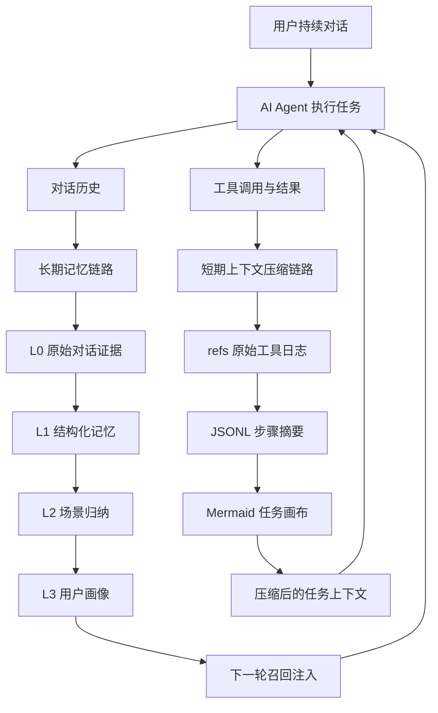

## 2. 总体目标：前台轻、后台重、证据不丢

这个项目的目标可以拆成五个层面。

第一，前台链路要轻。用户每轮对话结束后，系统不能马上阻塞主流程去做重型 LLM 抽取。它应该先把原始数据可靠记录下来，然后把复杂处理交给后台调度。

第二，记忆要有层次。原始对话、结构化事实、场景总结、用户画像，本质上是不同粒度的信息。它们的生命周期、召回方式、可信度和 token 成本都不一样。

第三，召回要稳。只靠向量检索容易漏掉关键词和专有名词；只靠关键词检索又不懂语义。系统需要同时支持语义相似和精确命中。

第四，压缩要可恢复。工具日志可以从 prompt 中移出去，但不能真的丢掉。上下文里可以只保留摘要和索引，但必须能通过 `node_id` / `result_ref` 找回原文。

第五，系统要能工程化运行。要支持多宿主，比如 OpenClaw 插件和 Hermes Gateway；要支持 checkpoint 恢复；要考虑并发 session、后台任务、定时调度和优雅关闭。

## 3. 核心架构：TdaiCore 作为宿主无关的内核

从代码结构看，项目把宿主适配和记忆核心分开了。

- OpenClaw 入口在 `index.ts`，负责注册 hooks、tools 和 context engine。
- Hermes / sidecar 入口在 `src/gateway/server.ts`，通过 HTTP 暴露 recall、capture、search、session end 等接口。
- 真正的核心能力封装在 `src/core/tdai-core.ts`。
- 后台调度器是 `src/utils/pipeline-manager.ts`。
- 上下文卸载逻辑在 `src/offload/`。

这种设计的好处是，记忆系统不是绑死在某一个 Agent 框架里。OpenClaw 通过 hooks 调它，Hermes 通过 Gateway HTTP 调它，但内部都走同一套 `TdaiCore`。

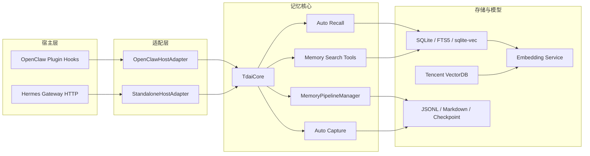

端到端数据流可以分成两条路径。

第一条是写入路径，也就是每轮对话结束后的 capture：

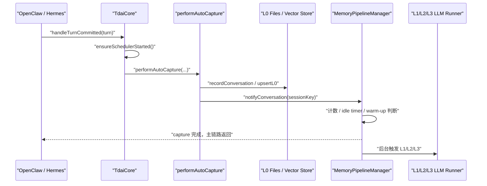

第二条是读取路径，也就是下一轮对话前的 recall：

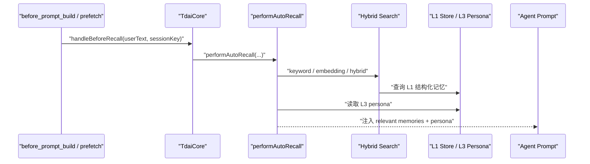

## 4. L0 到 L3：为什么记忆必须分层

面试里最容易被追问的是：为什么需要 L0 到 L3？为什么不直接把所有历史丢进向量库？

我的回答会是：因为不同层解决的是不同问题。它们不是简单的“越往上越短”，而是“职责不同”。

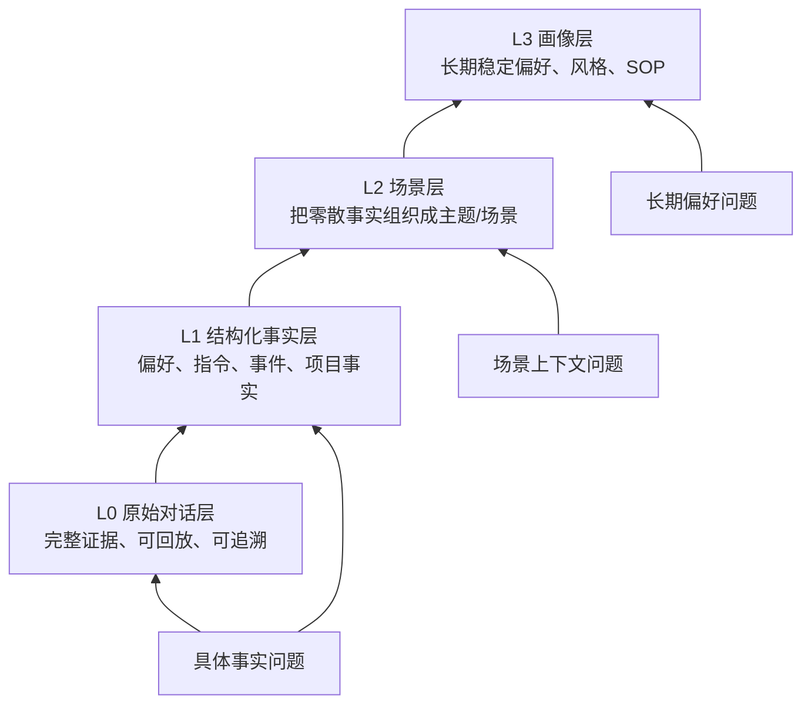

### 4.1 L0：解决证据保真

L0 是最底层的原始记录，主要保存对话消息、时间戳、角色、会话信息，以及必要的原始内容。

它解决的问题是：不管上层怎么抽象，都必须有一层可以回到事实来源。

这是对抗幻觉的关键。因为所有 LLM 摘要都有损失风险，尤其是代码任务里的错误日志、路径、参数、时间、用户原话。这些信息如果只存在摘要里，一旦摘要写错或漏掉，后面就没有办法恢复。

所以 L0 的定位不是“给 prompt 直接用”，而是“给系统兜底”。它可以被检索，可以被 L1 消费，也可以在高层记忆不够精确时作为证据回查。

### 4.2 L1：解决可检索事实

L1 是结构化记忆层。它会把原始对话抽成更干净的记忆单元，比如：

- 用户偏好：用户更喜欢简洁回答，或者喜欢先给结论。
- 明确指令：某个项目里不要改某类文件。
- 事件事实：上次修复了 checkpoint 并发覆盖问题。
- 项目上下文：某个仓库使用 SQLite + FTS5 + sqlite-vec。

L1 的价值是把长对话变成可检索、可去重、可评分的事实单元。

如果没有 L1，系统只能在原始对话里搜。原始对话通常很脏：有工具输出、有中间推理、有重复、有失败尝试。直接召回这些内容，不仅成本高，还容易把无关上下文带回 prompt。

### 4.3 L2：解决碎片组织

L1 还是“点状”的。一个真实用户或项目会产生很多条分散记忆。单条记忆可以回答局部事实，但很难给 Agent 提供宏观上下文。

L2 的作用是把 L1 记忆聚合成场景，比如：

- 用户在代码审查任务中的偏好。
- 某个项目的架构和协作约定。
- 某类 bug 修复流程中的常见模式。

这层解决的是“从点到块”的问题。它让召回不只是拿几条相似片段，而是能让 Agent 获得一个更完整的工作场景。

### 4.4 L3：解决长期稳定画像

L3 是用户画像或长期 profile。它关注的是稳定、跨场景、长期有效的信息，比如：

- 用户偏好的沟通方式。
- 用户常用技术栈。
- 用户对输出格式的稳定要求。
- 用户长期目标或工作习惯。

这类信息如果每轮都从 L1 临时检索、临时推理，成本高且不稳定。L3 把它们沉淀成更稳定的画像，下一轮对话前可以直接注入。

### 4.5 为什么不是一个向量库

只用一个向量库会有几个问题。

第一，向量库只解决“相似性搜索”，不解决信息分层。原始日志、事实记忆、场景总结、长期画像都混在一起，召回结果会变得很难解释。

第二，向量召回对专有名词、文件路径、错误码不一定稳定。比如 `recall_checkpoint.json`、`l2_pending_l1_count`、某个命令参数，这些更适合关键词检索。

第三，向量库不天然提供证据链。搜到一段摘要后，如果想知道它来自哪轮对话、哪个工具输出、哪个原文，必须额外设计索引。

第四，长期使用会产生重复、过期和冲突记忆。只做扁平向量堆积，很难维护记忆质量。

### 4.6 为什么不是一份摘要

只用一份摘要的问题更明显：不可逆。

摘要很适合压缩，但不适合作为唯一记忆。它会丢掉细节，尤其是代码任务里非常关键的证据，比如报错原文、具体文件、命令输出、时间顺序。

这个项目的基本原则是：

> 上层负责理解和方向，下层负责证据和精度。

也就是说，L3 能让 Agent 快速了解用户，L2 能让 Agent 理解场景，L1 能让 Agent 查到具体事实，L0 能让 Agent 回到原文证据。

## 5. 后台调度：为什么不是每轮都抽取

长期记忆的生成不是同步阻塞主流程，而是由 `MemoryPipelineManager` 后台调度。

它的设计重点是：前台只做 capture，后台再决定什么时候跑 L1、L2、L3。

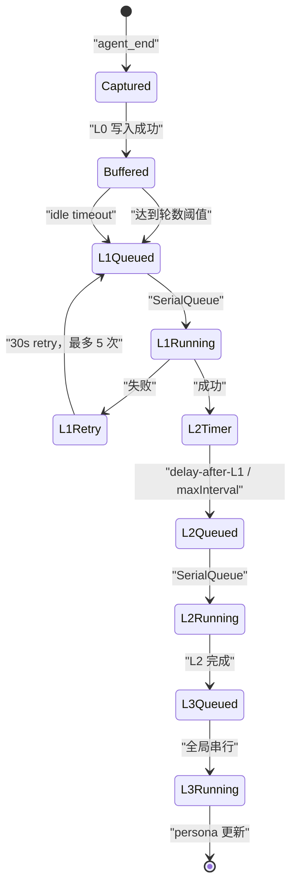

L1 的触发有三条路：

- 达到 `everyNConversations`，默认 5 轮。
- 用户空闲超过 `l1IdleTimeoutSeconds`，默认 600 秒。
- session end 或 gateway stop 时 flush。

新 session 还有 warm-up：第一次 1 轮就触发，然后变成 2、4，最后稳定到 5。这个设计是为了让早期记忆尽快可用，而不是等用户聊满 5 轮才开始记。

L2 的调度更有意思。它不是 L1 完成后立刻跑，而是用 downward-only timer：

```text
desiredTime = max(now + l2DelayAfterL1, lastL2 + l2MinInterval)
```

如果当前 timer 已经更早，就不推迟；如果新的触发时间更早，才提前。这解决了两个冲突目标：

- L1 后希望 L2 尽快更新。
- 同一个 session 的 L2 又不能太频繁。

L3 是全局串行加 pending 合并。如果 L3 正在跑，又来了新的 L2 完成事件，系统不会并发跑多个 persona 生成，而是打一个 pending 标记，等当前 L3 完成后补跑一次。

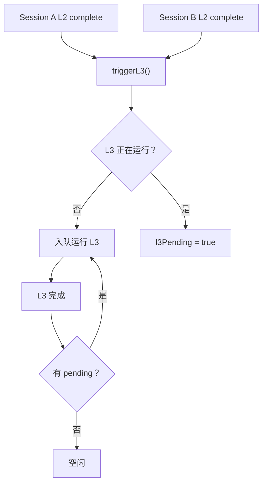

这个调度系统看起来不复杂，但它解决了工程上很实际的问题：

- 主对话不被记忆抽取阻塞。
- 多 session 的后台任务不会并发写乱。
- 失败后可重试。
- 进程重启后可以从 checkpoint 恢复。
- session end 只 flush 当前 session，不影响其他并发 session。

## 6. 混合检索：为什么需要向量、BM25 和 RRF

长期记忆召回不是一个单纯的语义搜索问题。用户问题大概可以分成三类。

第一类是语义型问题。比如“我之前偏好什么回答风格？”用户现在的表述和历史原文可能不一样，但含义接近。这类问题适合向量检索。

第二类是关键词型问题。比如“上次 checkpoint 那个 bug 怎么处理的？”这里的 `checkpoint`、文件名、错误码、命令参数都很重要。这类问题 BM25 / FTS 往往更稳。

第三类是混合型问题。真实问题通常既有语义，也有关键词。比如“上次 SQLite checkpoint 并发覆盖的问题最后怎么修的？”这里既要理解“并发覆盖问题”的语义，也要命中 `SQLite`、`checkpoint` 这些具体词。

所以系统支持三种策略：

- `embedding`：语义召回。
- `keyword`：FTS5 BM25 关键词召回。
- `hybrid`：两路并行召回，再用 RRF 融合。

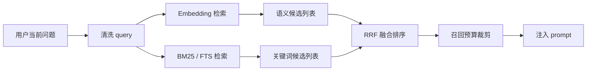

RRF 解决的是不同检索分数不可比的问题。

向量检索返回的是相似度分数，BM25 返回的是关键词相关性分数，这两个分数不是一个量纲。直接相加会很危险。

RRF 不看原始分数，只看排名。一个结果如果在向量检索里排第 2，在 BM25 里排第 3，它会得到两路排名贡献；如果一个结果只在某一路命中，也仍然有机会进入最终结果。

公式可以简化理解为：

```text
score(doc) = sum(1 / (k + rank(doc)))
```

项目里使用的 `k` 是常见的 60。它的效果是让“多路都认为不错”的结果更靠前，同时避免某一路分数尺度异常把排序带偏。

面试里可以这样讲：

> 向量负责“意思像不像”，BM25 负责“词有没有精确命中”，RRF 负责把两个排序体系融合起来。它不直接比较分数，而是比较名次，所以更稳。

关于 PersonaMem 从 48% 到 76%，更严谨的说法是：这是长期记忆任务的端到端回答准确率，不是单纯的向量召回率。

评估方式可以理解为：

1. 给 Agent 一批带用户偏好、事实、persona 的历史信息。
2. 后续用问题测试 Agent 是否能正确利用这些历史信息回答。
3. baseline 没有这套分层长期记忆时，最终回答准确率是 48%。
4. 接入分层记忆、混合召回和 persona 注入后，准确率到 76%。

这个提升不是 RRF 一个点单独带来的，而是几层能力叠加：

- L1 把历史抽成更干净的结构化记忆。
- Hybrid RRF 提升召回稳定性。
- L3 persona 让长期偏好低成本稳定注入。
- L0/L1/L2/L3 的证据链减少了不可解释的错误。

## 7. 上下文卸载：长任务里的“压缩但不失忆”

长期记忆解决跨会话经验沉淀，短期上下文压缩解决单个长任务里的 token 膨胀。

长任务中最耗 token 的通常不是用户问题，而是工具日志：

- `cat` / `sed` 读出的大段代码。
- 测试失败的长堆栈。
- 搜索结果。
- 多轮命令输出。
- 重复查看文件和目录结构。

如果这些都留在上下文里，模型会越来越慢、越来越贵，也越来越容易被旧信息干扰。

但这些日志又不能直接丢，因为后面可能要查某个错误、某个文件片段、某次命令结果。

所以系统采用“外部保真 + 上下文符号化”的设计。

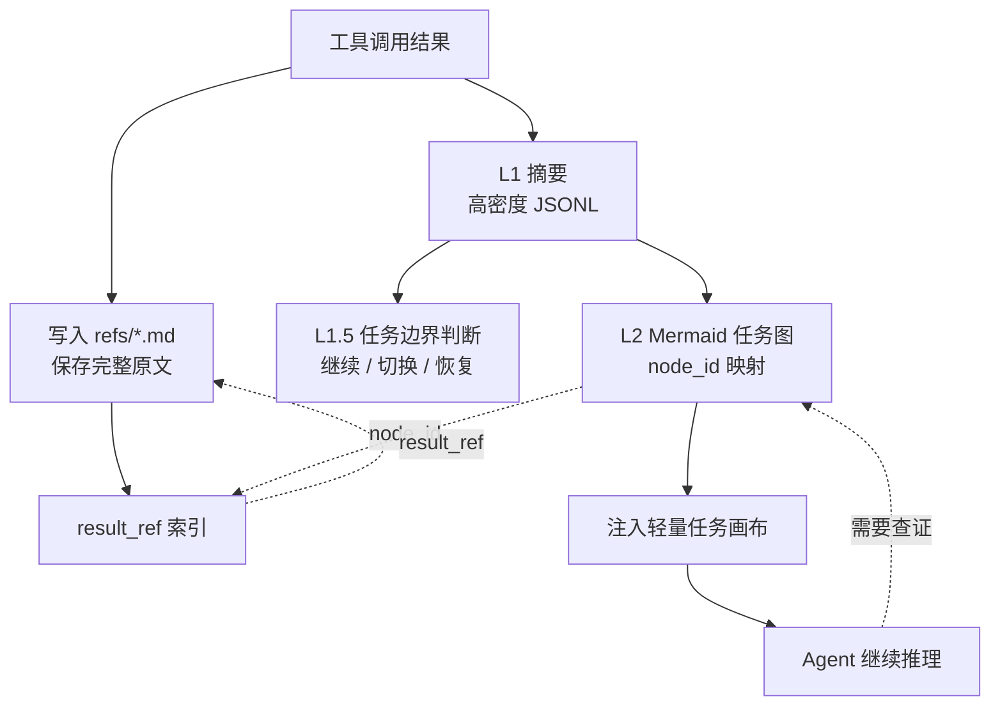

### 7.1 L1：工具调用变成步骤摘要

Context Offload 的 L1 会把一对 tool call / tool result 压缩成高密度摘要。

它不是简单截断，而是抽取这次工具调用对当前任务有什么价值。例如：

- 读了哪个文件。
- 发现了什么关键结构。
- 命令是否成功。
- 报错是什么。
- 这一步推进了任务，还是暴露了阻塞。

同时完整结果会保存在 `refs/*.md`，JSONL 里记录 `result_ref`。

### 7.2 L1.5：判断任务边界

压缩不能只按时间顺序做。因为一个 session 里可能发生任务切换：

- 用户从 bug 修复切到文档写作。
- 用户恢复了昨天的历史任务。
- 当前任务已经完成，开始新任务。

L1.5 的作用就是判断当前用户意图和已有任务图之间的关系。它会决定这是当前任务的延续，还是新任务，还是历史任务恢复。

这一步很关键，因为压缩策略需要知道哪些内容属于当前任务。当前任务的信息要更谨慎压缩，非当前任务的旧工具日志可以更积极折叠。

### 7.3 L2：Mermaid 任务画布

L2 会把多条工具摘要聚合成一个 Mermaid 任务图。

这个图不是为了视觉美观，而是为了用很少 token 表达任务状态。它包含：

- 已完成步骤。
- 当前进行中的节点。
- 失败或风险点。
- 节点之间的依赖关系。
- `node_id` 到工具调用摘要的映射。

Agent 在 prompt 里看到的是一个轻量图，而不是几十页工具日志。

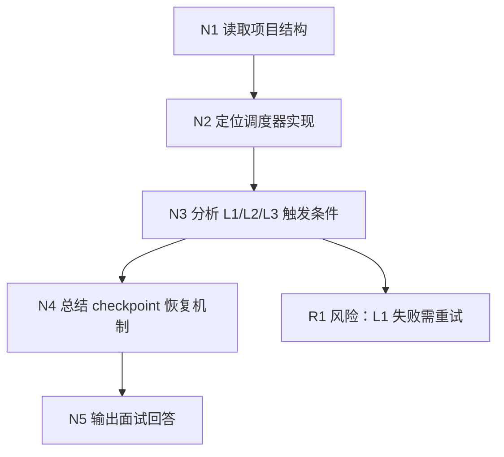

### 7.4 Prompt 侧压缩：保留、替换、删除

真正进入 prompt 前，系统会根据上下文窗口压力做不同级别压缩。

可以把策略理解成四档：

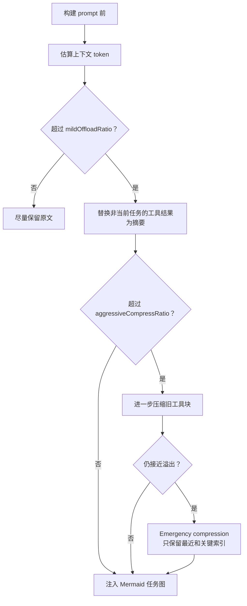

判断哪些信息保留、哪些压缩，主要看这些因素：

- 是否属于当前活跃任务。
- 是否已经有 L1 摘要。
- 是否已经映射到 Mermaid 节点。
- 是否有 `result_ref` 可以恢复原文。
- 离当前轮次远不远。
- 当前 token 压力多大。

它不是“越旧越删”，而是“证据可恢复的旧内容优先折叠，当前任务关键内容优先保留”。

### 7.5 中断后的恢复

任务恢复依赖两条线。

第一条是任务图恢复。系统可以重新注入 active Mermaid 或历史 Mermaid，让 Agent 看到之前做到了哪一步，哪些节点完成，哪里还在 doing。

第二条是原文追溯。Mermaid 节点带 `node_id`，JSONL 里有 `node_id -> result_ref`，`result_ref` 指向完整原始工具结果。

所以恢复时不是“读一段模糊摘要然后猜”，而是：

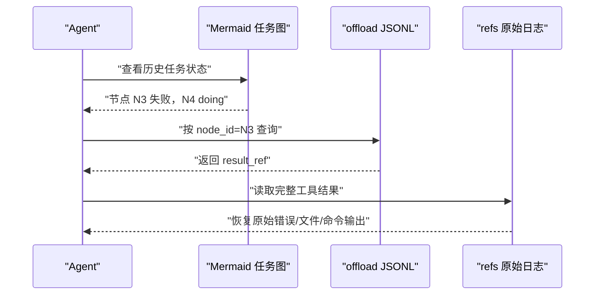

这就是“压缩但不失忆”的核心。

## 8. Checkpoint 与恢复：后台系统必须承认失败会发生

Agent 插件不是一次性脚本，它会在真实环境里长期运行。进程可能重启，Gateway 可能关闭，session 可能结束，后台 LLM 调用可能失败。

所以这个项目里 checkpoint 很重要。

checkpoint 里把状态拆成两类：

- `runner_states`：L0/L1 runner 拥有，比如 L0 capture cursor、L1 cursor、scene name。
- `pipeline_states`：调度器拥有，比如 conversation_count、last_active_time、L2 cursor、warm-up 状态。

这个拆分是为了避免不同模块互相覆盖状态。比如 L1 runner 更新了自己的 cursor，调度器只应该更新 pipeline 状态，不能把 runner 状态写没。

另外 checkpoint 写入有 per-file async lock，多个 `CheckpointManager` 实例共享同一把文件锁，避免并发读改写造成 JSON 损坏或状态回退。

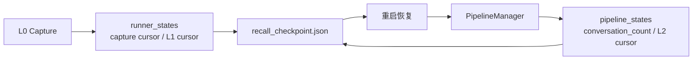

优雅关闭时，系统会尽量 flush L1/L2/L3 队列；如果超时，也会持久化当前状态，下次启动后再恢复。

还有一个细节：session end 和 process stop 是两种不同语义。

- session end 只 flush 当前 session，不能销毁整个 scheduler。
- gateway stop 才会销毁调度器、关闭 store 和 embedding service。

这个区分对并发 session 很重要。如果每个 session 结束都 destroy 全局 scheduler，就会把其他 session 的后台状态一起清掉。

## 9. 源码级落地细节：从配置、存储到 API 边界

上面讲的是系统设计。真正看源码时，可以把项目拆成几个更具体的工程面：配置默认值、文件目录、SQLite/TCVDB 存储、capture/recall hook、L1/L2/L3 生成器、offload 状态机、Gateway API、seed 导入和 profile 同步。

这一章的重点不是重复 README，而是把代码里实际发生的事情讲清楚。

### 9.1 配置默认值：零配置能跑，但能力按需退化

配置入口在 `src/config.ts`，核心函数是 `parseConfig()`。它的设计是“零配置可启动”，但不同能力会根据配置自动启用或退化。

几个关键默认值：

- `capture.enabled = true`：默认记录 L0 原始对话。
- `extraction.enabled = true`：默认开启后台 L1 抽取。
- `extraction.enableDedup = true`：默认做 L1 去重/冲突检测。
- `extraction.maxMemoriesPerSession = 20`：单次 L1 抽取最多保留 20 条记忆。
- `persona.triggerEveryN = 50`：累计一定数量新记忆后触发画像更新。
- `persona.maxScenes = 15`：L2 场景块最多保留 15 个。
- `pipeline.everyNConversations = 5`：稳定阶段每 5 轮触发一次 L1。
- `pipeline.enableWarmup = true`：新 session 从 1、2、4 轮逐步 warm-up。
- `pipeline.l1IdleTimeoutSeconds = 600`：空闲 10 分钟后触发 L1。
- `pipeline.l2DelayAfterL1Seconds = 10`：L1 完成后至少等 10 秒再考虑 L2。
- `pipeline.l2MinIntervalSeconds = 900`：同 session 的 L2 最小间隔 15 分钟。
- `pipeline.l2MaxIntervalSeconds = 3600`：活跃 session 最多每 1 小时轮询一次 L2。
- `pipeline.sessionActiveWindowHours = 24`：超过 24 小时不活跃的 session 停止 L2 轮询。
- `recall.strategy = "hybrid"`：默认混合召回。
- `recall.maxResults = 5`：默认注入 5 条 L1 记忆。
- `recall.timeoutMs = 5000`：召回超过 5 秒就跳过，避免阻塞用户。
- `storeBackend = "sqlite"`：默认本地 SQLite。
- `embedding.provider = "none"`：默认不启用远程 embedding，此时向量表延迟创建。
- `bm25.enabled = true`、`bm25.language = "zh"`：默认尝试中文 BM25 sparse 编码。
- `offload.enabled = false`：上下文卸载默认关闭，需要显式打开。
- `offload.defaultContextWindow = 200000`、`mmdMaxTokenRatio = 0.2`：默认按 20 万窗口估算，MMD 注入最多占 20%。

这里有一个很重要的工程取舍：配置错误不应该让整个 Agent 挂掉。比如 embedding 远程配置缺 `apiKey`、`baseUrl`、`model` 或 `dimensions` 时，代码不会抛异常中止，而是把 embedding 标记为 disabled，系统继续依赖 FTS/BM25 或文件层能力运行。

所以这个项目不是“必须有向量库才能跑”，而是：

> 本地记录和关键词检索是基本盘；embedding、TCVDB、offload、reporting 是逐步增强能力。

### 9.2 数据目录：长期记忆和短期 offload 分开存

长期记忆的数据目录由宿主决定：

- OpenClaw 插件模式通常在 `~/.openclaw/memory-tdai`。
- Standalone / Hermes Gateway 模式默认在 `~/.memory-tencentdb/memory-tdai`。
- Gateway 还保留了旧目录 `~/memory-tdai` 的兼容逻辑：如果新目录不存在但旧目录有数据，就继续使用旧目录并提示迁移。

`initDataDirectories()` 会创建这些长期记忆目录：

```text
memory-tdai/
  conversations/        # L0 JSONL，按天分片
  records/              # L1 JSONL，按天分片
  scene_blocks/         # L2 场景块 Markdown
  persona.md            # L3 用户画像
  vectors.db            # SQLite 后端的主数据库
  .metadata/
    recall_checkpoint.json
  .backup/
```

L0 的文件路径是 `conversations/YYYY-MM-DD.jsonl`，L1 的文件路径是 `records/YYYY-MM-DD.jsonl`。这两个 JSONL 都是追加写，方便 grep、流式读取和故障排查。

Context Offload 有自己的数据根，默认是 `~/.openclaw/context-offload`，并且按 agent 隔离：

```text
context-offload/
  <agent-name>/
    offload-<sessionId>.jsonl
    refs/
      <timestamp>.md
    mmds/
      <task>.mmd
    state.json
    sessions-registry.json
```

这个隔离很关键。长期记忆是跨任务沉淀，offload 是当前任务上下文压缩。二者有交集，但不应该混在同一套文件里。

### 9.3 SQLite 本地存储：元数据、向量、FTS 三套索引并行

默认 SQLite 后端在 `src/core/store/sqlite.ts`，数据库文件是 `vectors.db`。

它不是只建一个向量表，而是 L1 和 L0 各有三类结构：

```text
L1:
  l1_records      # 结构化记忆元数据
  l1_vec          # sqlite-vec 向量表，cosine distance
  l1_fts          # FTS5 BM25 关键词索引

L0:
  l0_conversations # 原始消息元数据
  l0_vec           # sqlite-vec 向量表
  l0_fts           # FTS5 BM25 关键词索引

Meta:
  embedding_meta   # embedding provider / dimensions 兼容性信息
```

`l1_records` 的字段包括：

- `record_id`：记忆 ID。
- `content`：结构化记忆正文。
- `type`：`persona` / `episodic` / `instruction`。
- `priority`：0 到 100，`-1` 表示强约束类全局指令。
- `scene_name`：所属场景。
- `session_key` / `session_id`：来源 session。
- `timestamp_str`、`timestamp_start`、`timestamp_end`：事件时间。
- `created_time`、`updated_time`：写入和更新光标。
- `metadata_json`：类型相关扩展字段。

`l0_conversations` 的字段包括：

- `record_id`：单条消息 ID。
- `session_key` / `session_id`：来源 session。
- `role`：user / assistant / tool。
- `message_text`：清洗后的消息正文。
- `recorded_at`：记录时间。
- `timestamp`：原始消息时间戳。

FTS5 表使用 v2 schema：索引列保存 jieba 分词后的文本，`content_original` / `message_text_original` 作为 `UNINDEXED` 字段保存原文用于展示。中文场景下这比直接用 `unicode61` 切中文字符稳定得多。如果 `@node-rs/jieba` 不可用，就退回 Unicode 正则分词。

向量表是延迟创建的：当 `embedding.dimensions = 0`，也就是默认 `provider="none"` 时，不创建 `l1_vec` 和 `l0_vec`。等用户真正配置 embedding 后，再按真实维度创建，避免先用占位维度建表导致后续维度不匹配。

`embedding_meta` 的作用是记录 provider/dimensions 信息。如果发现旧库没有 meta，或者 vec0 表维度和当前配置不一致，代码会丢弃并重建向量表，但保留 `l1_records` 和 `l0_conversations` 元数据。

这解释了为什么系统能“本地先跑起来，后面再接 embedding”：元数据和 FTS 是稳定底座，向量索引是可重建派生物。

### 9.4 TCVDB 后端：服务端 dense embedding + 客户端 sparse BM25

TCVDB 后端在 `src/core/store/tcvdb.ts`，由 `storeBackend = "tcvdb"` 启用。它创建三个 collection：

```text
<database>_l1_memories
<database>_l0_conversations
<database>_profiles
```

L1 collection 的 embedding 字段是 `text`，L0 collection 的 embedding 字段是 `message_text`。这表示 dense embedding 由 TCVDB 服务端完成，客户端不需要自己生成 dense vector。

与此同时，客户端会用本地 BM25 encoder 生成 `sparse_vector` 写入文档。查询时如果 BM25 encoder 可用，就调用 TCVDB 原生 `hybridSearch`：

```text
dense ann search + sparse match + rerank { method: "rrf", k: 60 }
```

如果 BM25 sparse 不可用，就退化为 dense-only 的 `embeddingItems` 搜索。

TCVDB 初始化还有几个工程细节：

- collection 名加 database 前缀，因为同一 TCVDB 实例下 collection 名全局唯一。
- 向量索引优先尝试 `DISK_FLAT`，如果实例不支持则 fallback 到 `HNSW`。
- profiles collection 关闭 embedding，因为它存的是 L2/L3 Markdown profile，不走向量召回。
- 如果远程初始化失败，store 会进入 degraded 状态，上层继续用文件或非向量路径运行。

这套后端设计的意义是把“向量召回”和“关键词召回”都下沉到云端能力里，但仍保留和 SQLite 一致的 `IMemoryStore` 抽象。

### 9.5 Capture：L0 写入必须快，而且必须去掉注入污染

每轮对话结束后，OpenClaw 的 `agent_end` 或 Gateway 的 `/capture` 会进入 `TdaiCore.handleTurnCommitted()`，再调用 `performAutoCapture()`。

capture 的实际流程是：

1. `CheckpointManager.captureAtomically()` 读取当前 session 的 L0 cursor。
2. `recordConversation()` 从本轮消息中筛出新增 user/assistant 消息。
3. 对消息做清洗，去掉 memory 注入块、scene navigation、offload MMD、Gateway inbound metadata、base64 image data 等。
4. 写入 `conversations/YYYY-MM-DD.jsonl`。
5. 写入 L0 store：SQLite 下先写 metadata + FTS，embedding 在后台补；TCVDB 下走同步 upsert 或服务端 embedding。
6. 通知 `MemoryPipelineManager.notifyConversation(sessionKey, [])`。

这里有两个细节非常值得讲。

第一，L0 capture 是“相对宽松”的，L1 extraction 才是严格过滤。`shouldCaptureL0()` 主要过滤框架噪声、空内容、slash command；`shouldExtractL1()` 会额外过滤过短文本、低信息密度文本和 prompt injection。这样做是为了 L0 尽量保真，而 L1 尽量干净。

第二，capture 会缓存“被 recall 注入污染前的原始用户问题”。因为 `before_prompt_build` 可能把 `<relevant-memories>` 注入到用户消息前面，如果后续 L0 直接记录 framework 里的 message，就会把注入内容再次写回记忆，形成反馈循环。`index.ts` 用 `pendingOriginalPrompts` 缓存原文和 messageCount，`l0-recorder.ts` 再按位置或时间戳把污染后的用户消息替换回干净版本。

SQLite 的 L0 embedding 还有一个性能优化：`supportsDeferredEmbedding = true`。capture 主链路只写 metadata 和 FTS，然后 fire-and-forget 后台 `embedBatch + updateL0Embedding()`。`TdaiCore.destroy()` 会等待这些后台任务最多 5 秒，避免关闭数据库后还有迟到写入。

### 9.6 L1 抽取、去重和写入：JSONL 是审计日志，Store 是检索真相

L1 抽取入口在 `src/core/record/l1-extractor.ts`。

它的流程是：

1. 从 L0 store 或 JSONL fallback 读取当前 session 的新增消息。
2. 用 `shouldExtractL1()` 做严格质量过滤。
3. 调 LLM，一次完成 scene segmentation 和 memory extraction。
4. 把结果限制在 `maxMemoriesPerSession`。
5. 如果 `enableDedup = true`，调用 `batchDedup()` 做冲突检测。
6. 根据 dedup decision 写入 L1 JSONL 和 VectorStore。

L1 记忆类型在 v3 里收敛为三类：

- `persona`：用户稳定偏好、身份、长期约束。
- `episodic`：发生过的事件、任务进展、阶段性事实。
- `instruction`：明确规则、禁止事项、输出格式要求。

写入逻辑在 `src/core/record/l1-writer.ts`。每条 `MemoryRecord` 包含 `id`、`content`、`type`、`priority`、`scene_name`、`source_message_ids`、`metadata`、`timestamps`、`createdAt`、`updatedAt`、`sessionKey`、`sessionId`。

去重动作有四种：

- `store`：新增一条。
- `update`：删除旧记录，写入更新后的新记录。
- `merge`：删除多个旧记录，写入合并后的记录。
- `skip`：跳过。

关键点是：VectorStore 是实时检索真相，JSONL 是追加式审计日志。update/merge 时会从 VectorStore 删除旧记录，保证召回不会命中过期版本；但旧 JSONL 行不会立刻改写，而是由 cleaner 后续按 store 真相清理。这避免了频繁重写历史文件，也保留了审计痕迹。

### 9.7 Recall：动态 L1 放 user 前缀，稳定 L2/L3 放 system 后缀

召回入口在 `src/core/hooks/auto-recall.ts`，由 `TdaiCore.handleBeforeRecall()` 调用。

召回分成两部分注入：

- `prependContext`：动态的 L1 relevant memories，作为用户 prompt 前缀。
- `appendSystemContext`：稳定的 L3 persona、L2 scene navigation、memory tools guide，追加到 system context。

这个拆分是为 prompt cache 服务的。L1 每轮都变，放到用户侧；L2/L3 变化低频，放 system 尾部，模型供应商的 prompt caching 更容易命中。

Hybrid 搜索路径也有两套实现：

- SQLite：本地并行跑 FTS5 BM25 和 embedding search，再在客户端用 RRF 合并，`k = 60`。
- TCVDB：如果 store capability 标记 `nativeHybridSearch = true`，直接调用远端 hybridSearch，避免本地重复 embedding。

召回还有几个保护：

- query 会先 `sanitizeText()`，去掉媒体、metadata 和注入标签。
- query 太短会跳过搜索。
- `recall.timeoutMs` 到期直接返回 undefined，宁愿本轮不注入，也不拖慢用户。
- `maxCharsPerMemory` 和 `maxTotalRecallChars` 可以限制注入字符数。
- 注入的 memory tools guide 明确告诉 Agent：`tdai_memory_search` 和 `tdai_conversation_search` 合计最多调用 3 次。

所以 recall 不是简单“搜几条拼上去”，而是在性能、缓存、可控搜索次数和可追溯工具调用之间做平衡。

### 9.8 L2/L3：场景文件、画像文件和远端 profile 同步

L2 场景抽取由 `SceneExtractor` 负责，产物在 `scene_blocks/*.md`。L3 画像由 `PersonaGenerator` 负责，产物是 `persona.md`。

L2/L3 的本地文件不是孤立的。`profile-sync.ts` 会把本地 `scene_blocks` 和 `persona.md` 映射成 profile records：

- L2 文件类型是 `l2`，文件名来自 scene block。
- L3 文件类型是 `l3`，文件名固定为 `persona.md`。
- stable id 用 `scope + type + filename` 做 SHA-256，保证跨机器/跨同步稳定。
- 内容带 `contentMd5`、`version`、`createdAtMs`、`updatedAtMs`。

在 TCVDB 后端，profiles collection 会保存这些 L2/L3 文件。同步时有 baseline version 检查：如果远端版本从拉取时的 baseline 之后又被别人推进，本地会跳过写入，避免覆盖远端更新。

还有一个体验细节：`persona.md` 里会追加 scene navigation。recall 时先用 `stripSceneNavigation()` 取画像正文，再单独生成 `<scene-navigation>`，避免导航内容污染 persona 本体。

### 9.9 Context Offload 的文件模型：每条工具结果都有可恢复证据链

Offload 的类型在 `src/offload/types.ts`。核心记录是 `OffloadEntry`：

```ts
interface OffloadEntry {
  timestamp: string;
  node_id: string | null;
  tool_call: string;
  summary: string;
  result_ref: string;
  tool_call_id: string;
  session_key?: string;
  score?: number;
}
```

每个字段都有明确职责：

- `tool_call_id`：和模型/工具调用链路对齐，用于去重和替换原始 tool result。
- `result_ref`：指向 `refs/*.md`，保存完整工具输出。
- `summary`：L1 生成的可读摘要。
- `score`：摘要替代原文的可信程度，越高越适合被压缩替换。
- `node_id`：L2 Mermaid 节点 ID，初始为 null，L2 运行后回填。

`storage.ts` 对 JSONL 做了几层防御：

- 写入前去掉 unsafe control characters。
- 解析时跳过损坏行和 schema invalid 行。
- append 时按 `tool_call_id` 做去重。
- `readAllOffloadEntries()` 会读当前 agent 下所有 `offload-*.jsonl`，让 L2 可以跨 session 聚合任务画布。
- `updateOffloadNodeIds()` 会把 L2 生成的 node_id 回填到所有相关 JSONL 行。

MMD 文件存放在 `mmds/`，完整工具原文存放在 `refs/`。恢复链路可以精确表达为：

```text
Mermaid node_id
  -> offload-<sessionId>.jsonl 中的 OffloadEntry
  -> result_ref
  -> refs/<timestamp>.md 完整工具结果
```

这就是它和普通压缩摘要的区别：摘要只是入口，原文仍然可读。

### 9.10 Offload 运行模式：local、backend、collect

`offload.mode` 有三种：

- `local`：本地直接调用 LLM 做 L1/L1.5/L2。
- `backend`：通过 `backendUrl` 调远端服务。
- `collect`：只收集数据并异步跑部分任务，不占用 contextEngine slot，适合观测或离线分析。

触发策略有几类默认值：

- `forceTriggerThreshold = 4`：pending tool pairs 达到 4 对强制触发 L1。
- `maxPairsPerBatch = 20`：单批最多处理 20 对工具调用。
- `l2NullThreshold = 4`：`node_id = null` 的 entry 达到 4 条触发 L2。
- `l2TimeoutSeconds = 300`：5 分钟没跑 L2 也会考虑触发。
- `mildOffloadRatio = 0.5`：上下文达到窗口 50% 时开始温和替换。
- `aggressiveCompressRatio = 0.85`：达到 85% 时更积极压缩。
- `emergencyCompressRatio = 0.95`：接近溢出时进入应急压缩。
- `emergencyTargetRatio = 0.6`：应急压缩目标是降回 60%。

所以它不是等到上下文爆了才处理，而是分阶段治理：

```text
轻压缩：替换非当前任务、替代评分高的工具结果
强压缩：删除或折叠更旧的工具块
应急压缩：只保留最近消息、关键任务图和可恢复索引
```

这套逻辑在 `hooks/llm-input-l3.ts`、`l3-helpers.ts`、`mmd-injector.ts` 等文件里协作完成。

### 9.11 Gateway：把同一套 TdaiCore 暴露成 HTTP 服务

Gateway 在 `src/gateway/server.ts`，不用 Express/Fastify，而是基于 Node 原生 `http` 模块。它把 `TdaiCore` 暴露成 HTTP API：

```text
GET  /health
POST /recall
POST /capture
POST /search/memories
POST /search/conversations
POST /session/end
POST /seed
```

对应关系很直接：

- `/recall` 调 `handleBeforeRecall()`。
- `/capture` 调 `handleTurnCommitted()`。
- `/search/memories` 调 L1 memory search。
- `/search/conversations` 调 L0 conversation search。
- `/session/end` 调 `handleSessionEnd()`，只 flush 当前 session。
- `/seed` 调 seed runtime，把历史数据灌进 L0/L1。

安全模型是 optional Bearer token：

- `GET /health` 永远不需要认证，方便健康检查。
- 如果配置了 `server.apiKey` 或 `TDAI_GATEWAY_API_KEY`，其他接口都要求 `Authorization: Bearer <key>`。
- token 比较使用 `crypto.timingSafeEqual()`，避免长度相等时的 timing attack。
- 如果 gateway 绑定到非 loopback host 但没配置 apiKey，启动时会打 warning。

配置加载顺序也很实用：

1. 显式 config path。
2. 当前工作目录的 `tdai-gateway.yaml` / `tdai-gateway.json`。
3. dataDir 下的同名配置。
4. 环境变量。

默认监听 `127.0.0.1:8420`，这也是为什么它可以作为 Hermes sidecar：主 Agent 不需要理解 OpenClaw 插件机制，只要调用 HTTP API。

### 9.12 Seed：把历史会话批量灌入同一条 L0→L1 管线

seed 入口有两个：

- CLI：`openclaw memory-tdai seed`，在 `src/cli/commands/seed.ts`。
- Gateway：`POST /seed`。

它的目标是把历史对话导入成可召回记忆，而不是只复制文件。

seed runtime 在 `src/core/seed/seed-runtime.ts`，复用 live runtime 的 pipeline factory：同一套 store 初始化、L1 runner、L2 runner、L3 runner 和 persister。这样历史导入和线上 capture 不会产生两套不一致逻辑。

几个实现细节：

- 输入会被 normalize 成 `sessions -> rounds -> messages`。
- timestamp 可以是 ISO string 或 number；缺失时 CLI 会要求确认，`--yes` 则自动用当前时间填充。
- seed 模式下 `captureStartTimestamp = 0`，故意不使用 live 模式的冷启动保护，因为 seed 就是要导入历史。
- 每处理到 `everyNConversations` 会等待 L1 idle，再继续喂下一批，避免一次性把所有历史都堆到 L1 单批里，破坏生产环境的 batching 语义。
- 当前实现主要等待 L1 idle；L2/L3 runner 虽然已接线，但不会强等完成，避免 seed 任务过长。
- 输出目录默认是 `<stateDir>/memory-tdai-seed-<YYYYMMDD-HHmmss>`。

这说明 seed 不是一个离线转换脚本，而是“用同一条生产记忆管线重放历史”。

### 9.13 多宿主适配：OpenClaw 和 Hermes 共享同一个核心

`TdaiCore` 是宿主无关 facade。它只依赖抽象的 `HostAdapter`、`LLMRunnerFactory`、`IMemoryStore` 和配置，不直接依赖 OpenClaw 或 Gateway。

OpenClaw 模式由 `index.ts` 做薄适配：

- 注册 hooks。
- 注册 CLI。
- 注册 `tdai_memory_search` / `tdai_conversation_search` 工具。
- 在 `before_prompt_build` 调 recall。
- 在 `agent_end` 调 capture。
- 在 `gateway_stop` 做 destroy。
- 根据 host 版本自动 patch hook policy。

Gateway 模式则用 `StandaloneHostAdapter` 和 standalone LLM runner。`TdaiCore.wirePipelineRunners()` 里还有一个决策：

- OpenClaw 且未启用 `cfg.llm.enabled` 时，优先用宿主内置 LLM runner。
- standalone / Hermes 或显式启用 `llm` 时，用 OpenAI-compatible API 直接调用记忆抽取模型。

这使得主 Agent 可以用一个昂贵模型，而 L1/L2/L3 记忆任务可以用另一个更便宜、更稳定的模型。

### 9.14 运维治理：manifest、清理、过滤、时区和指标

这个项目里还有一些“不显眼但很工程化”的细节。

第一是 manifest。`src/utils/manifest.ts` 会在 `<dataDir>/.metadata/manifest.json` 记录数据目录的 store 绑定：

```json
{
  "version": 1,
  "createdAt": "...",
  "store": {
    "type": "sqlite"
  },
  "seed": null
}
```

如果是 TCVDB，会记录 url、database 和 alias；如果是 SQLite，会记录 db path。这个 manifest 首次成功初始化后写入，后续启动只做 diff 和 debug log，不会自动覆盖。它的作用是让一个 dataDir 自描述：以后排查“这个目录原来连的是哪个后端、是不是换过库”时有依据。

第二是本地清理器。`LocalMemoryCleaner` 由 `capture.l0l1RetentionDays` 控制，默认关闭。开启后每天按 `cleanTime`，默认 `03:00`，清理 `conversations/` 和 `records/` 里的过期分片，并同步删除 store 里的 L0/L1 过期记录。清理按配置时区的“本地自然日”计算，不是简单 `now - N*24h`。同时有最小保留保护：L0 总数小于等于 50、L1 总数小于等于 20 时跳过删除，避免新用户或小样本目录被清空。

第三是 session 过滤。`SessionFilter` 有硬编码内置规则，也接受 `capture.excludeAgents` 的 glob：

- 跳过 `:memory-scene-extract-`，避免 L2/L3 内部 LLM 任务反过来污染用户记忆。
- 跳过 `:subagent:`，避免子 Agent 的临时任务被当成主用户历史。
- 跳过 `temp:`，避免临时工具 session。
- hook context 中 `sessionId` 以 `memory-` 开头也会跳过。

第四是统一时区。`timezone` 默认是 `system`，也支持 IANA 名称和 `+08:00` 这种 UTC offset。存储里的机器时间仍然用 UTC instant；给 LLM、文件分片和清理自然日看的时间走配置时区。`formatForLLM()` 会输出带显式 offset 的时间，例如 `2026-04-07T11:04:45+08:00`，这能减少“昨天、上周、几小时前”这类记忆推理的歧义。

第五是 reporting。`report.enabled` 默认关闭；开启 local reporter 后，会把结构化事件写到 logger，包括 pipeline trigger、L1 extraction、agent turn 等。`instance_id` 存在 `.metadata/instance_id`，用于把同一个插件实例的事件串起来。reporter 的异常永远不会阻塞业务逻辑。

## 10. 工程取舍：为什么这套设计能落地

这套系统有几个关键取舍。

### 10.1 不追求同步强一致，而追求最终可用

记忆不是交易系统，不需要每轮对话后立刻完成全部 L1/L2/L3。更重要的是不要阻塞用户。所以 capture 先落盘，后面异步抽取。

### 10.2 不把摘要当真相

摘要只是一层索引，不是唯一事实来源。系统始终保留 L0 原文或 refs 原始日志，必要时可以下钻。

### 10.3 不把向量库当万能

向量适合语义，BM25 适合关键词，RRF 负责融合。真实记忆召回需要混合策略。

### 10.4 不把压缩等同于删除

上下文压缩的目标不是永久删除历史，而是把重内容移出 prompt，把轻量索引留在 prompt。

### 10.5 不让后台任务无限并发

L1、L2、L3 使用串行队列，避免文件、数据库和 checkpoint 被并发写乱。L3 还做 pending 合并，避免 persona 生成风暴。

## 11. 面试追问视角：可以怎么回答

如果面试官问“这个项目最核心的业务问题是什么”，可以答：

> 核心问题是长程 Agent 的记忆失控。历史全塞进 prompt 会爆 token，只做摘要又丢证据。所以我们要做的是一套既能沉淀长期经验，又能压缩短期上下文，还能保证证据可追溯的记忆系统。

如果问“你为什么设计 L0 到 L3”，可以答：

> 因为不同信息粒度解决不同问题。L0 保留原始证据，L1 抽取可检索事实，L2 把碎片组织成场景，L3 沉淀长期稳定画像。如果只用向量库，会变成扁平碎片；如果只用摘要，会不可逆地丢细节。

如果问“RRF 解决了什么问题”，可以答：

> 向量检索和 BM25 的分数不是一个量纲，不能简单相加。RRF 用排名而不是原始分数融合结果。两个检索系统都排得靠前的结果会被提升，只在一路命中的结果也不会完全丢掉。

如果问“上下文压缩怎么保证不丢信息”，可以答：

> 我们不是直接删除工具日志，而是把完整日志写到外部 refs，把摘要写进 JSONL，再用 Mermaid 任务图放进上下文。prompt 里是轻量结构，原始证据通过 node_id 和 result_ref 可以随时找回。

如果问“你负责的关键模块是什么”，可以按这几个说：

> 我主要负责记忆管线的调度设计、L0 到 L3 的分层建模、混合召回链路、上下文卸载机制，以及 checkpoint 恢复和多宿主适配上的工程化问题。

## 12. 总结：这个项目真正的价值

TencentDB Agent Memory 的价值不在于“给 Agent 加了一个数据库”，而在于它把 Agent 记忆问题拆成了几个可工程化的问题：

- 历史怎么保真：L0 / refs。
- 事实怎么检索：L1。
- 碎片怎么组织：L2。
- 长期偏好怎么稳定注入：L3。
- 召回怎么更稳：embedding + BM25 + RRF。
- 上下文怎么变轻：Context Offload + Mermaid。
- 任务怎么恢复：node_id / result_ref / checkpoint。

最终形成的是一个闭环：

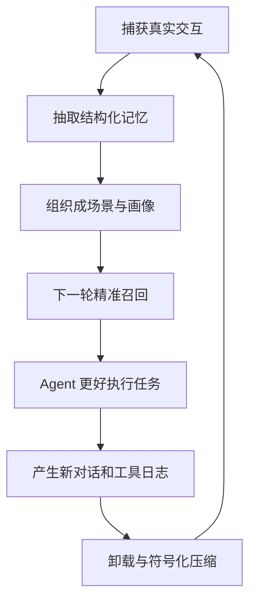

这套设计的核心思想可以总结成一句话：

> 让 Agent 的记忆既能折叠，也能展开；既能抽象，也能追证；既能长期沉淀，也能在当前任务里保持轻量。
