本文从面试追问的视角，系统拆解 CodeWiki 这个项目：它为什么不是普通“代码 RAG”，为什么要先做 AST 和确定性 Code Graph，GraphRAG 怎样把符号、源码 chunk、图扩展和社区摘要组合起来，Wiki 生成又如何通过源码引用、Mermaid 校验、LLM 缓存和增量更新来降低幻觉。

如果只用一句话概括这个项目：

> CodeWiki 是一个本地优先的代码智能平台，它先用多语言 AST 解析和确定性图谱把仓库变成可查询的结构化事实，再用 GraphRAG 选择相关源码和依赖关系，最后用带源码引用校验的 LLM 生成 Wiki、回答问题，并通过 CLI、HTTP API、MCP 和 Lite Mode 服务人类开发者与 Coding Agent。

需要先明确一个边界：CodeWiki 不是一个完整 SaaS 多租户知识库，也不是一个能做全语言精确类型推导的编译器。它的定位更工程化：面向单机、本地仓库、单用户或本地团队工作流，用 AST、文件扫描、启发式符号解析、FTS/vector 检索和 LLM 生成搭建一套“代码理解操作台”。源码里也能看到几个明确边界：

- 跨文件调用、引用、类型继承的解析是启发式和置信度标注的，不是语言服务器级别的完整语义分析。
- GraphRAG 的 vector search 是可选能力；默认 FTS + 图扩展也能工作。
- Retrieval trace 当前通过稳定 ID 返回，但 `/graphrag/traces/{trace_id}` 还只是 `not_persisted_yet`。
- Wiki Agent workflow 是“给 Agent 规划、取证、保存、校验”的工具链，不是一个自动多步工具调用的 autonomous agent。
- 默认产品形态是 local-first，没有把鉴权、多租户、权限系统作为核心目标。

## 1. 背景：代码理解的问题不是“搜不到”，而是“上下文不可靠”

传统代码问答很容易从一个朴素方案开始：

- 把仓库文件切 chunk。
- 对 chunk 做 embedding。
- 用户提问时相似度检索。
- 把若干片段塞给 LLM 生成回答。

这个方案做 demo 很快，但在真实代码仓库里会遇到几个问题。

第一，源码不是普通文档。一个函数的含义往往取决于类、调用方、被调用方、路由、配置、数据模型和导入关系。只检索文本相似 chunk，很容易召回“词相似但结构无关”的片段。

第二，代码里有大量专有名词。函数名、文件路径、环境变量、框架装饰器、API 路径、配置文件名，这些信息既需要关键词精确命中，也需要图上的依赖扩展。纯向量检索不稳定，纯关键词检索又不懂结构。

第三，文档生成比问答更难。问答可以短回答，但 Wiki 要系统化组织仓库：Overview、Architecture、API、Workflow、Data Model、Operations。生成这么长的内容时，如果没有 source refs、graph refs 和校验机制，LLM 很容易写出“看起来合理但源码没有证据”的段落。

第四，代码仓库会变。文档如果只能一次性生成，很快就过期。真实工具要知道哪些文件变了、哪些图节点受影响、哪些 Wiki 页面需要重建。

所以 CodeWiki 没有把 LLM 放在第一层，而是先建立一层结构化事实：

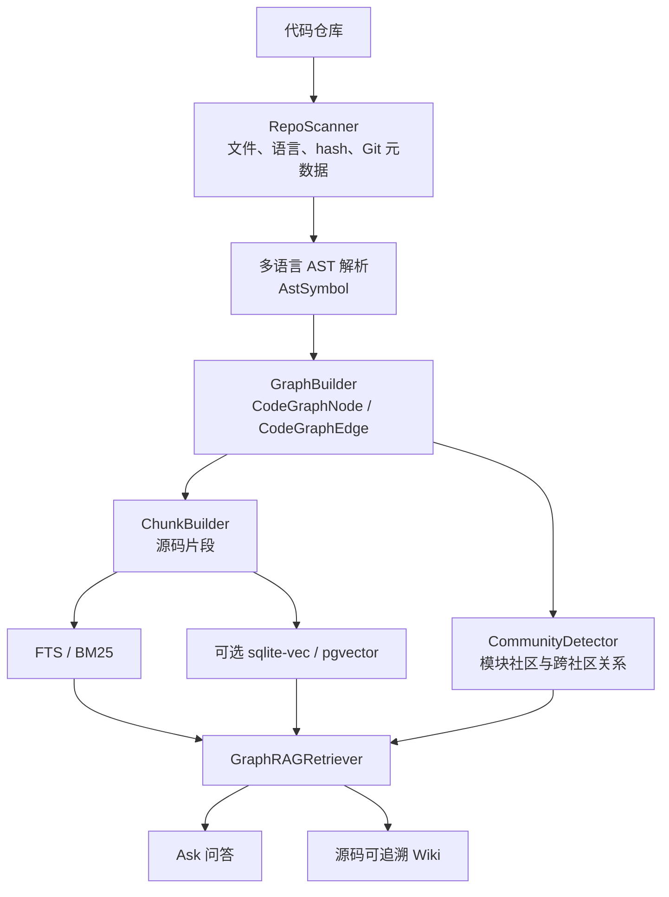

这套架构的核心思想是：

> 先用确定性程序尽量提取事实，再让 LLM 做组织、表达和解释；LLM 输出必须被源码引用、图引用、Markdown 结构和 Mermaid 校验约束住。

## 2. 总体目标：把仓库变成可查询、可生成、可更新的代码知识库

从源码结构看，CodeWiki 的目标可以拆成七层。

第一层是仓库接入。`RepoScanner` 支持本地路径和 Git URL。Git URL 会被 clone 到 `storage/repos` 下；repo id 用解析后路径的 SHA1 前 16 位生成。扫描阶段会处理忽略规则、二进制文件、文件大小、语言识别、sha256、mtime、Git commit time。

第二层是 AST 结构化。`AstParser` 通过语言 registry 分发到 Python、Java、Go、Rust、C、C++、C#、TypeScript、TSX、JavaScript、JSX 等解析器。统一产物是 `AstSymbol`，包括 `type/name/file_path/start_line/end_line/signature/docstring/imports/calls/references/bases/implements/decorators` 等字段。

第三层是 Code Graph。`GraphBuilder` 把仓库、目录、文件、配置、类、函数、方法、endpoint、schema 等变成 `CodeGraphNode`，把 contains、defines、imports、exports、inherits、implements、routes_to、calls、references、uses_config 变成 `CodeGraphEdge`。每条边带 `confidence`、`is_inferred`、`reason` 和 provenance。

第四层是社区与模块视图。`CommunityDetector` 用 NetworkX 图和边权做 Louvain/Leiden/贪心模块度分区，并构建父子社区、细节社区和跨社区依赖边。`CommunityNamer` 可以用 LLM 给社区重命名和总结。

第五层是 GraphRAG。检索不是“搜 chunk 就结束”，而是先从符号搜索找 seed，再合并 FTS/vector 命中的 chunk，把命中节点沿图扩展，最后选择源码片段、图边、社区摘要和社区边组成 context pack。

第六层是 Wiki 和 Ask。Ask 使用 GraphRAG 上下文回答问题。Wiki 则先生成目录，再生成每一页；页面生成必须返回 JSON，必须引用允许的 source refs，必须通过 Markdown、citation、diagram placeholder 和 Mermaid 校验。

第七层是产品入口。FastAPI 暴露 HTTP API，React 前端提供 Repos/Graph/Wiki/Ask/Settings 工作台，Click CLI 支持命令行，MCP server 支持 Agent 工具调用，Lite Mode 在项目内创建 `.codewiki/codewiki-lite.sqlite3`，让 Codex / Claude Code 这类 agent 用本地图谱快速取上下文。

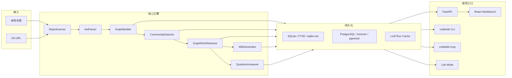

## 3. 项目形态：一个本地工作台，四类使用入口

CodeWiki 不是只有一个 backend service。它在代码里有几种并行入口。

第一是 Web 工作台。`backend/app/main.py` 创建 FastAPI app，挂载 `/api/repos` 下的 repos、files、graph、wiki、ask、runs 路由，以及 `/api/settings`。前端由 `frontend/src/App.tsx` 驱动，顶部导航是 Repos、Graph、Wiki、Ask、Settings。Graph 是主视图，其余页面在非 Graph 模式下作为侧栏工作区出现。

第二是 CLI。`backend/app/cli/main.py` 注册 `analyze`、`update`、`repos`、`graph`、`graphrag`、`wiki`、`ask`、`files`、`serve`、`lite`、`skill`、`config` 等命令。面试里可以说 CLI 不是附属 demo，而是完整覆盖了分析、增量、GraphRAG、Wiki 和 Lite Mode。

第三是 MCP server。`backend/app/mcp_server/tools.py` 定义了大量工具，例如：

- `codewiki_analyze`
- `codewiki_update`
- `codewiki_retrieve_context`
- `codewiki_ask`
- `codewiki_graph_search`
- `codewiki_context`
- `codewiki_trace`
- `codewiki_node`
- `codewiki_wiki_plan`
- `codewiki_wiki_evidence`
- `codewiki_wiki_page_save`
- `codewiki_wiki_page_validate`

这说明它面向 Coding Agent 的能力不是只给一个“搜索”工具，而是提供一套从取上下文、追调用链、读节点、生成 Wiki 到保存校验的工具协议。

第四是 Lite Mode。`backend/app/services/lite.py` 把索引放到项目本地 `.codewiki/codewiki-lite.sqlite3`。`codewiki lite index .` 可以不依赖 LLM 建立轻量图谱；`codewiki lite context`、`trace`、`node`、`affected` 可以为 agent 提供快速静态上下文；`codewiki lite agents install` 会给 Codex 或 Claude Code 写 MCP 配置。

这四类入口共享同一套 store、analysis、graph query、GraphRAG 和 Wiki 服务，所以不是四套重复实现。

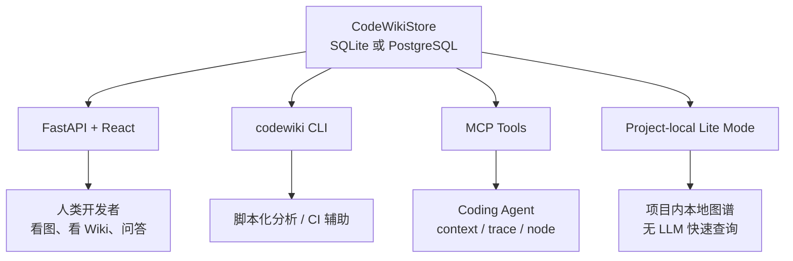

## 4. 扫描层：RepoScanner 负责把仓库变成可增量比较的文件集合

`RepoScanner` 是最底层入口，它解决的问题不是“读文件”这么简单，而是要给后续增量分析提供稳定事实。

它的核心职责包括：

- 支持本地路径和 Git URL。
- Git URL 通过 `clone_path_for_git_url()` 生成稳定 clone 目录。
- `describe()` 生成 `RepoDescriptor`，包含 id、name、path、source_type、git_url、commit_hash。
- `scan()` 走 `FileSystemWalker`，跳过忽略文件、二进制文件、超大文件。
- 默认最大文件大小是 2MB。
- 每个文件生成 `ScannedFile`，包含相对路径、绝对路径、语言、sha256、size、mtime、是否源码等。
- 如果 Git 可用，会补充每个源码文件的最近 commit 时间。

增量分析时它还有一个重要优化：`known_hashes`、`known_file_metadata` 和 `hash_paths`。如果文件 size 和 modified_at 没变，而且不在 Git diff 候选里，就可以复用旧 hash，避免全仓重算 sha256。

这让扫描层同时支持两种变化检测：

```text
优先路径：git diff + sha256
兜底路径：全量 sha256 对比
```

面试里可以这样讲：

> RepoScanner 不只是把文件列出来，它会把每个文件变成带语言、hash、mtime、Git 元数据的稳定记录。后面增量分析能知道哪些文件变了、哪些没变、哪些删了，本质上依赖这层。

## 5. AST 层：多语言统一成 AstSymbol，而不是直接对文本做 RAG

CodeWiki 支持多语言，但后续图构建不想关心每种语言的 AST 细节，所以中间抽象是统一的 `AstSymbol`。

`parse_scanned_files()` 会过滤出 `is_source` 文件，并发解析。并发数默认取 `min(file_count, cpu_count, 4)`，也可以通过 `CODEWIKI_AST_PARSE_WORKERS` 覆盖。每个 worker 会 fork 一个 parser，避免线程间 parser 状态冲突。

`AstSymbol` 不是只记录函数名，而是一组足够构图的信息：

```text
id
type
name
file_path
language
start_line / end_line
parent_id
signature
docstring
imports / exports
bases / implements
decorators
calls / references
hash / metadata
```

这里最重要的是统一性。Python、Java、Go、Rust、C/C++、C#、ECMAScript 系语言的解析结果都要落到同一个图谱接口上。这样后面的 GraphBuilder 可以围绕 `imports/calls/references/bases` 构边，而不是关心 tree-sitter 的具体节点结构。

AST 解析失败不会让整个仓库分析失败。`parse_scanned_files()` 捕获 `SyntaxError`，把错误记录到 `parse_errors`，继续解析其他文件。这对真实仓库很重要，因为仓库里经常会有语法不完整、生成中间产物、版本不匹配文件。

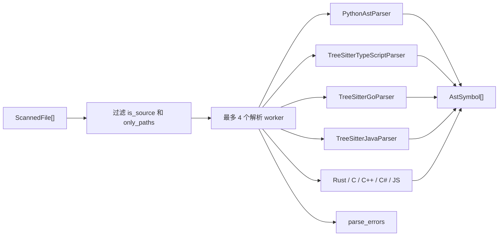

## 6. 图谱层：Code Graph 是 CodeWiki 的事实底座

CodeWiki 的核心不是 chunk，而是 `CodeGraph`。

`CodeGraphNode` 的字段很克制：

```text
id, repo_id, type, name, file_path,
start_line, end_line, language, symbol_id,
summary, hash, metadata
```

`CodeGraphEdge` 则包含：

```text
id, repo_id, source_id, target_id, type,
confidence, weight, is_inferred, metadata
```

这种设计有两个好处。

第一，节点和边都可以序列化到数据库，并被 API、前端、MCP、CLI 共用。第二，边上保留置信度和 provenance，可以把“确定性结构边”和“启发式推断边”区分开。

`GraphBuilder.build()` 的顺序大概是：

1. 创建 repository 节点。
2. 为目录创建 directory 节点。
3. 为每个文件创建 file 或 config 节点。
4. 为每个非 file 的 `AstSymbol` 创建 symbol 节点。
5. 建立 contains、defines、exports 等结构边。
6. 根据 imports 建立文件导入边。
7. 根据 bases/implements 建立继承和实现边。
8. 根据 endpoint handler 建立 routes_to 边。
9. 根据 calls/references 建立调用和引用边。
10. 根据配置文件检测和引用建立 uses_config 边。

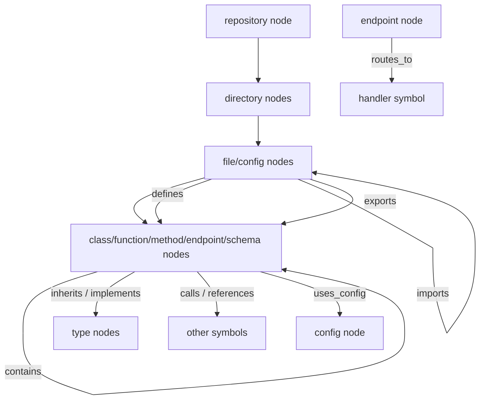

### 6.1 确定性边和推断边要分开讲

图谱里有些边是比较确定的，例如：

- 目录 contains 文件。
- 文件 defines 函数。
- 类 contains 方法。

这些结构来自扫描和 AST，可信度高。

但有些边是启发式解析的，例如：

- 一个 call name 对应哪个跨文件函数。
- 一个 reference 对应哪个 symbol。
- 一个字符串或变量引用是否指向某个 config 文件。

这类边会设置 `is_inferred=True`，并带 `reason`、`resolution_tier`、`confidence`。这正是 CodeWiki 的工程成熟点：它没有假装自己是编译器，而是把不确定性显式写进图里。

### 6.2 config 节点是代码理解里的小但关键设计

`GraphBuilder` 会调用 `detect_config_file()` 判断文件是否是配置。配置文件会被标成 `type="config"`，metadata 里有 `config_kind`、`config_reason`、`config_confidence`。

后续如果 import 或 reference 命中 config，图上会出现 `uses_config` 边。这对解释项目启动、环境变量、部署、模型配置非常有用，因为很多业务行为不是函数调用出来的，而是配置驱动的。

### 6.3 图谱 ID 的意义

节点和边 ID 都是稳定生成的。稳定 ID 的价值是：

- 增量更新时能比较旧图和新图。
- Wiki 的 `graph_refs` 可以引用具体节点或边。
- 前端可以稳定定位节点详情。
- MCP agent 可以围绕 node id 做 trace、node context 和 affected 分析。

## 7. 社区检测：从函数图变成模块地图

只展示几千个节点和边没有意义，CodeWiki 还做了一层社区检测。

`CommunityDetector` 会选取 file、config、class、function、method、schema、endpoint 等节点进入社区图，忽略 external 节点。边权按类型不同：

```text
calls / routes_to: 1.0
inherits: 0.9
implements: 0.86
imports: 0.75
exports: 0.65
references: 0.62
uses_config: 0.58
defines: 0.5
contains: 0.42
```

这个权重体现了一个判断：调用、路由、继承比单纯目录包含更能说明模块关系。

分区算法有降级链路：

1. 优先 `networkx_louvain`。
2. 如果失败，尝试 `graspologic_leiden`。
3. 再失败，用 `networkx_greedy_modularity`。
4. 没边时退化为 connected components。

社区不是平铺一层。它会先做 leaf partition，再构建 community graph，生成 parent partition，并在大社区里做 detail split。最终会得到 level 0 / level 1 / level 2 的层级社区。

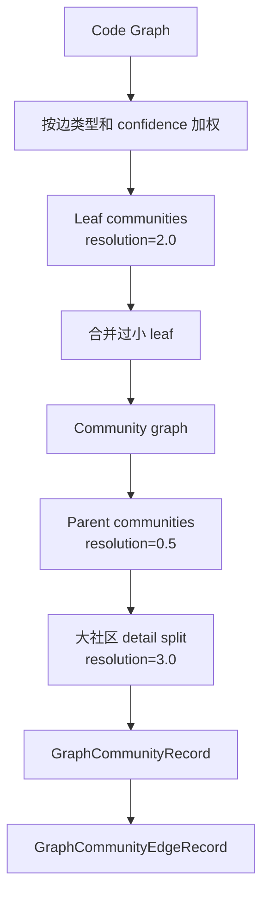

`CommunityRecordBuilder` 会给每个社区生成一个初始 name 和 summary。这个 summary 是 deterministic 的，包含关键文件、关键 symbol、内部关系和边界关系。LLM 没配置时也能用。

如果配置了 LLM，`CommunityNamer` 会批量生成更自然的社区名和摘要。这里也走 `CachedLLMService`，任务类型是 `community_summary`，prompt version 是 `community_naming:v2`，并把 LLM run 记录到数据库。

社区边由 `CommunityEdgeBuilder` 从底层 code edge 聚合而来：

- parent -> child 是 `contains`。
- calls 聚合成 `calls_into`。
- imports/exports 聚合成 `imports_from`。
- routes_to 保持 `routes_to`。
- 其他依赖聚合成 `depends_on`。

这让 GraphRAG 和 Wiki 不只能看到“函数 A 调函数 B”，还能看到“模块 A 调用模块 B”。

## 8. GraphRAG：不是 chunk 检索，而是符号 seed + 图扩展 + 证据打包

GraphRAG 是 CodeWiki 和普通代码 RAG 最大的区别。

`GraphRAGRetriever.retrieve()` 的主流程是：

1. 检查 repo 是否存在、图是否已分析。
2. 用 `filter_wiki_graph()` 过滤文档噪声节点。
3. 如果没有源码 chunk，先自动 `build_index(include_embeddings=False)`。
4. 从符号搜索拿 seed nodes。
5. 从 FTS 搜源码 chunks。
6. 如果 `include_embeddings=True`，再做 vector search。
7. 把 chunk hits 合并回 graph seed。
8. 如果没有 seed，用 repository 和若干 file 节点做 overview fallback。
9. seed 最多保留 `MAX_SEED_NODES`。
10. 沿图扩展 0 到 4 hop。
11. 选择 source chunks，受 `graphrag_context_token_budget` 和 `graphrag_max_source_chunks` 限制。
12. 加入社区摘要和社区边。
13. 返回 `RetrievalTrace`。

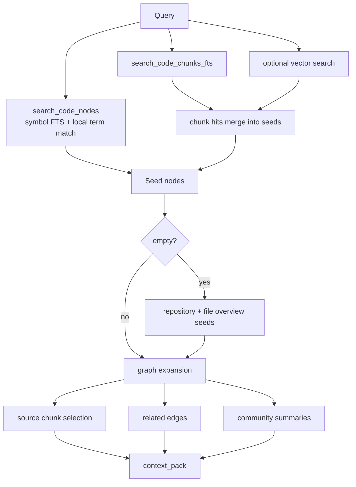

### 8.1 seed_from_symbols：先找符号入口

`seed_from_symbols()` 不是只在 Python list 里匹配，它会优先调用 `store.search_code_nodes()`。SQLite 下走 FTS5，PostgreSQL 下走 `websearch_to_tsquery` / `tsvector`，再兜底 LIKE。

搜索命中会被限制到 `SEED_NODE_TYPES`，避免目录、仓库等过粗节点占满 seed。然后还会做本地 term matching，比如 name 精确匹配、query 包含 symbol name、共享 term 等。

这一步的价值是把问题先定位到代码结构上。例如用户问“登录接口怎么走”，seed 可能是 endpoint、handler function 或 auth service，而不是一个随机 README chunk。

### 8.2 FTS 和 vector 是源码证据，不是唯一入口

`search_fts()` 对 query 做 FTS 查询，然后 `store.search_code_chunks_fts()` 找源码片段。SQLite 用 FTS5 `bm25(code_chunk_fts)`，Postgres 用 `websearch_to_tsquery` + `ts_rank_cd`，如果都没有则 LIKE。

vector search 由 `EmbeddingIndex` 触发，只有 `include_embeddings=True` 时使用。默认路径不用 embedding，这让 CodeWiki 在无模型或低配置环境下也能跑基础 GraphRAG。

`merge_chunk_hits_into_seeds()` 会把命中的 chunk 反推到 node：优先用 chunk.node_id，没有则用 file_path 找 file node。这一步让文本检索结果进入图扩展阶段。

### 8.3 select_source_chunks：token 预算和噪声过滤

`select_source_chunks()` 会把候选 chunk 排序，并过滤掉：

- lockfile：`uv.lock`、`package-lock.json`、`pnpm-lock.yaml`、`yarn.lock`
- wiki noise file
- 单个 chunk 超过 token budget 的片段
- 总 token 超预算的片段

默认配置在 `Settings` 里：

```text
graphrag_context_token_budget = 8000
graphrag_max_source_chunks = 20
```

这说明 GraphRAG 不是无限塞上下文，而是把源码证据控制在预算内。

### 8.4 context_pack 是 LLM 的事实输入

`context_pack()` 会组织成几类信息：

- Query
- Source Chunks
- Community Summaries
- Community Relationships
- Graph Facts
- token_count、node_count、edge_count、chunk_count、community_count
- source_chunk_ids、node_ids、edge_ids、community_ids

Ask 和 Wiki 都使用这个 trace，只是 prompt 和输出要求不同。

## 9. Chunk 与 Embedding：源码证据层兼容 SQLite 和 PostgreSQL

GraphRAG 的 chunk 由 `ChunkBuilder` 根据图节点和源码内容生成，并存到 `code_chunk` 表。`CodeChunkRecord` 关键字段是：

```text
id
repo_id
node_id
file_path
start_line / end_line
content
content_hash
token_count
```

SQLite 还有 FTS5 虚拟表 `code_chunk_fts`。PostgreSQL 则在 `code_chunk` 上创建 GIN tsvector index。

Embedding 是可选索引。`code_chunk_embedding` 表保存 embedding 的元数据，但真正向量存储分两种：

- SQLite：按维度创建 `code_chunk_embedding_vec_<dimensions>` 虚拟表，使用 `sqlite-vec` 的 `vec0`，并用 `repo_id`、`model` 做 partition key。
- PostgreSQL：按维度创建同名表，字段是 `vector(dimensions)`，并创建 HNSW cosine index。

这种“元数据表 + 按维度向量表”的设计解决了一个实际问题：不同 embedding 模型维度可能不同，不能硬塞到一张固定维度表里。

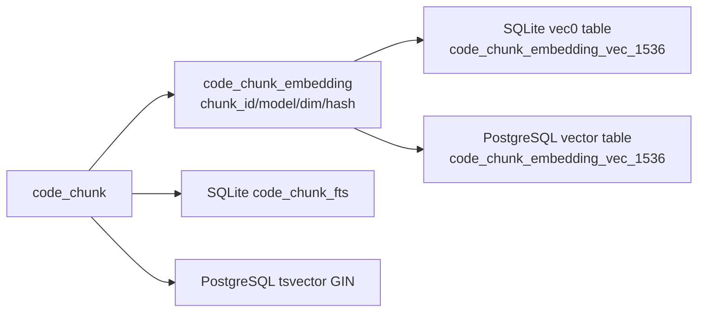

## 10. 存储层：小 mixin 组合成统一 CodeWikiStore

`backend/app/db/store.py` 里，`SQLiteStore` 和 `PostgresStore` 都由一组 repository mixin 组合出来：

- `RepoRepositoryMixin`
- `AnalysisRunRepositoryMixin`
- `CodeGraphRepositoryMixin`
- `GraphRAGRepositoryMixin`
- `WikiRepositoryMixin`
- `LLMRunRepositoryMixin`

其中 `GraphRAGRepositoryMixin` 又组合了：

- `CodeChunkRepositoryMixin`
- `CodeChunkEmbeddingRepositoryMixin`
- `GraphCommunityRepositoryMixin`

这种组合方式的好处是：业务服务只依赖 `CodeWikiStore`，不用到处判断 SQLite 或 PostgreSQL。

SQLite 默认配置比较适合 local-first：

```text
PRAGMA foreign_keys = ON
PRAGMA busy_timeout = 30s
PRAGMA journal_mode = WAL
PRAGMA synchronous = NORMAL
```

PostgreSQL 则启用连接池、`pool_pre_ping`、`pool_recycle`，并尝试创建 `vector` extension。如果 extension 不可用，`supports_pgvector=False`，文本搜索仍可用。

数据库模型可以按业务分组理解：

```text
repo
analysis_run
code_node
code_edge
graph_community
graph_community_edge
code_chunk
code_chunk_embedding
doc_catalog
doc_page
llm_run
```

这里有几个关键约束：

- `doc_page` 通过 `(repo_id, language_code, slug)` 做唯一索引。
- `code_chunk` 通过 `(repo_id, content_hash, file_path, start_line, end_line)` 去重。
- `code_chunk_embedding` 通过 `(repo_id, chunk_id, model)` 唯一。
- `llm_run` 通过 repo/task/cache/input/model/prompt_version 建索引，支撑本地 LLM cache。

## 11. 分析与增量更新：不是每次都全仓重建

`AnalysisService.analyze()` 是仓库分析的主入口。它会创建或复用 `analysis_run`，然后执行：

1. 扫描仓库。
2. 如果已有旧图且不是 force，生成增量计划。
3. 如果没有 affected files，直接返回 `mode="unchanged"`。
4. 如果有变化，只解析 changed/new 文件。
5. 对 unchanged 文件，从旧图恢复 symbols。
6. 用新旧 symbols 合并构图。
7. 重新检测社区。
8. 持久化图和社区。
9. 写入 repo metadata。

增量计划由 `_plan_from_scan()` 生成，核心集合是：

```text
changed_files
new_files
deleted_files
unchanged_files
affected_files = changed + new + deleted
```

如果 Git diff 能拿到候选路径，策略是 `git_diff+sha256`；否则是 `sha256`。

`IncrementalUpdater.update()` 是更面向外部调用的增量更新服务。它不仅更新图，还会：

- 刷新受影响文件的 chunks。
- 用 `_affected_graph_refs()` 找受影响节点和边。
- 调 `store.mark_doc_pages_stale()` 把引用了相关文件或 graph_refs 的 Wiki 页面标成 draft。
- 可选触发 Wiki regeneration。

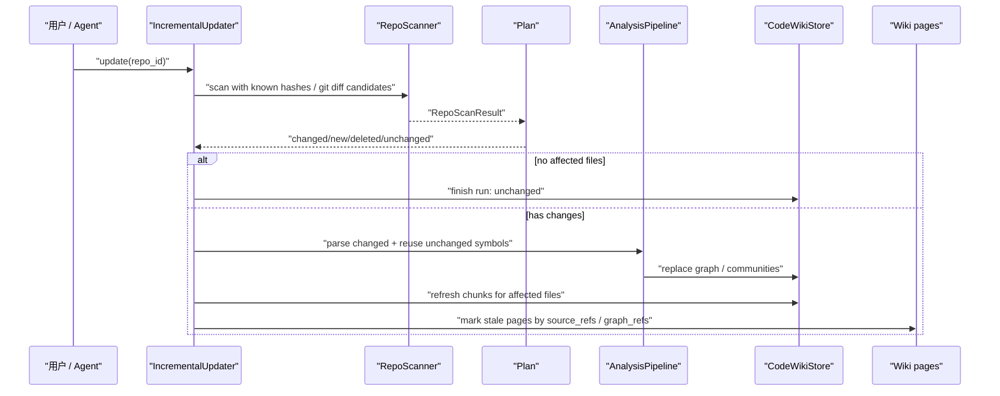

面试里可以强调：CodeWiki 的增量不是简单“只重新扫文件”，而是从扫描、AST、图谱、chunks、Wiki stale 标记都打通了。

## 12. LLM 层：LiteLLM 网关、任务路由、本地缓存和运行审计

CodeWiki 没有让业务服务直接 import 各家模型 SDK，而是用 `LLMGateway` 包住 LiteLLM。

`ModelRouter` 按 task type 选择 profile：

```text
catalog              max_tokens 4096
community_summary    max_tokens 4096
cluster              复用 community_summary profile
page                 max_tokens 12000
translation          max_tokens 12000
qa                   stream=True
embedding            无默认 max_tokens
```

配置来自 `CODEWIKI_LLM__...` 这种嵌套环境变量。每个 profile 可以有 model、provider_type、endpoint、api_key、max_tokens。`LLMGateway` 会转换成 LiteLLM 所需的 `model`、`api_base`、`api_key`、`temperature`、`timeout`、`num_retries`。

真正重要的是 `CachedLLMService` 和 `LLMOperation`。

`LLMOperation` 把一次 LLM 调用的关键因素都封装起来：

```text
task_type
messages
input_payload
cache_namespace
cache_parts
model_alias
prompt_version
response_format
provider_user_id
```

`complete_with_cache()` 会对 `input_payload` 做 SHA256，组合 cache_key，再查 `llm_run` 表。如果相同 repo、task、cache_key、input_hash、model、prompt_version 下已有成功响应，就直接返回 cached run，同时再写一条 `cached=True` 的运行记录，cost_usd 为 0。

如果 LLM 调用失败，也会写 `status="error"` 的 `llm_run`，并清洗错误信息，去掉 API key、authorization bearer 等敏感信息。

这层带来的好处是：

- 目录、页面、翻译、社区命名都能复用缓存。
- prompt version 变更后自然失效。
- 失败不是静默丢失，而是能通过 run_id 查。
- API 返回 LLM 失败时能给 `task_type` 和 `run_id`。
- 前端 Wiki API 能统计 local cache hits 和 provider prompt cache hit ratio。

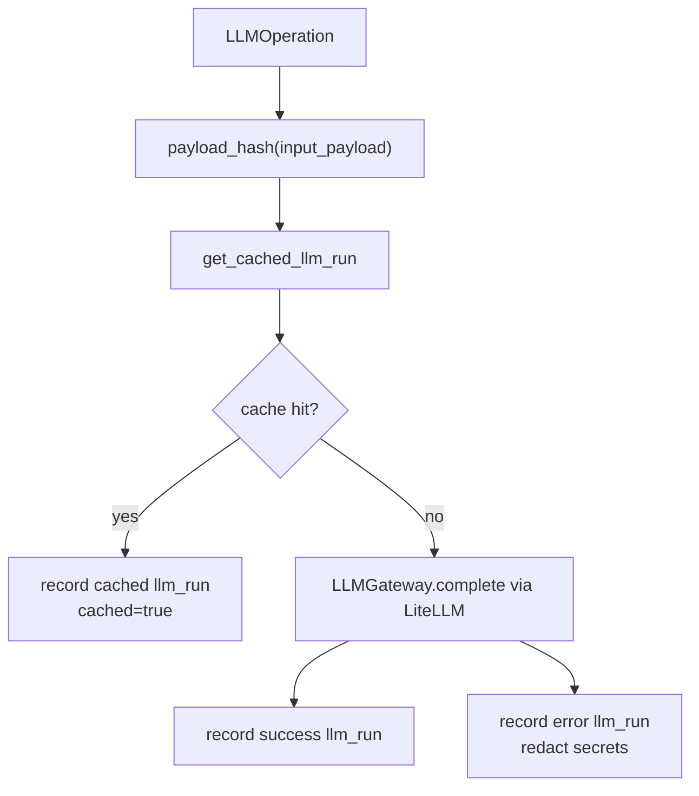

## 13. Ask 问答：GraphRAG 上下文加源码引用要求

`QuestionAnswerer.answer()` 的逻辑很直接：

1. 检查 repo 是否存在。
2. 只支持 `mode="graph_rag"`。
3. 调 `GraphRAGRetriever.retrieve()` 获取 trace。
4. 根据请求决定是否返回 related nodes / edges / communities / sources。
5. 构造 `QAPromptContext`。
6. 用 `CachedLLMService` 调 `task_type="qa"`。
7. 返回 answer、sources、related graph 和 trace_id。

Prompt 里有一个明确合同：

```text
Use only this GraphRAG context. Cite files and lines from sources when making code claims.
```

也就是说 Ask 不是让模型自由发挥，而是把 GraphRAG 的 `context_pack`、source chunks、related nodes、related edges、community summaries 作为事实输入。

这个模块的价值在于短链路验证：如果用户只是问“这个函数谁调用”“这个模块怎么工作”，不一定要生成完整 Wiki，Ask 就能通过 GraphRAG 给出带来源的回答。

## 14. Wiki 目录生成：先规划信息架构，再生成页面

Wiki 不是从文件逐个生成，而是先生成 catalog。

`WikiCatalogGenerator.generate_catalog()` 会先做一次 `"repository overview"` 的 GraphRAG，再读取全图和社区，计算 `CatalogScaleLimits`，构造 LLM payload。

payload 里包含：

- repo id/name/path/git_url/commit_hash
- documentation_style：DeepWiki 风格说明
- catalog_scale：tiny/small/medium/large/xlarge 规模限制
- granularity_contract：页面数量、层级、拆分触发条件
- repository_context：从文件系统推断的仓库上下文
- module_candidates：按目录和图关系生成的模块候选
- context_pack：GraphRAG 摘要字段
- seed_nodes / expanded_nodes
- community_edges / community_summaries / hierarchy
- source_chunks
- required_json_shape 示例

目录生成最多尝试 3 次。如果 LLM 输出不是合法 JSON，或者不满足 catalog payload 校验，会把 previous_response、validation_errors 和 repair_instructions 放回 payload，再让模型修复。

规模限制很关键。`catalog_limits_for_repo()` 会根据 file_count、node_count、edge_count、chunk_count、community_count 选择：

```text
tiny   4-8 pages
small  8-16 pages
medium 16-32 pages
large  28-56 pages
xlarge 44-88 pages
```

这避免了两个极端：小项目生成一堆空页面，大项目只生成一个“Backend”巨页。

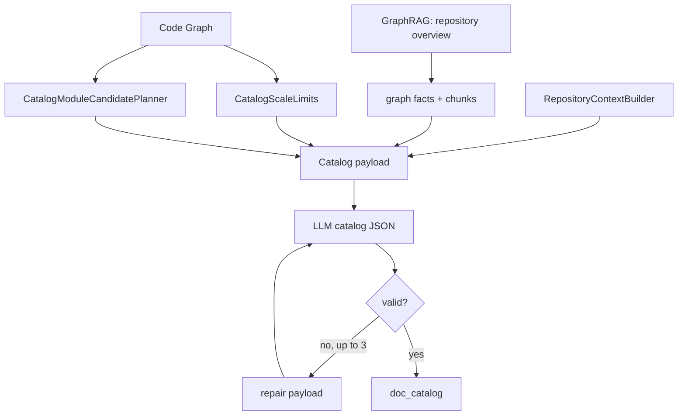

## 15. Wiki 页面生成：源码引用是硬约束，不是装饰

`WikiPageGenerator.generate_page()` 是 CodeWiki 最能体现“防幻觉”的地方。

单页生成流程如下：

1. 从 catalog item 取 title、slug、topic、source_hints。
2. 用 topic 做 GraphRAG，max_hops 固定 3。
3. 根据 source_hints 补充 source hint chunks。
4. 从 trace 计算 graph_refs 和 allowed_source_refs。
5. 服务端根据 graph facts 生成 Mermaid diagram plan。
6. 根据 source_hints 额外读取文件证据 `readfile_evidence_for_page()`。
7. 构造 page generation payload。
8. 用稳定 prompt contract、stable repo context 和 dynamic payload 调 LLM。
9. 要求返回 JSON object。
10. 如果 JSON 解析失败，进入 JSON repair。
11. 如果 source refs、Markdown、citation、diagram placeholder 校验失败，进入 validation repair。
12. 成功后替换 citation markers，服务端组合 Mermaid 图和 source refs。
13. 异步校验 Mermaid；无效则过滤图，仍无效则移除图。
14. 如果仍失败，保存 draft。

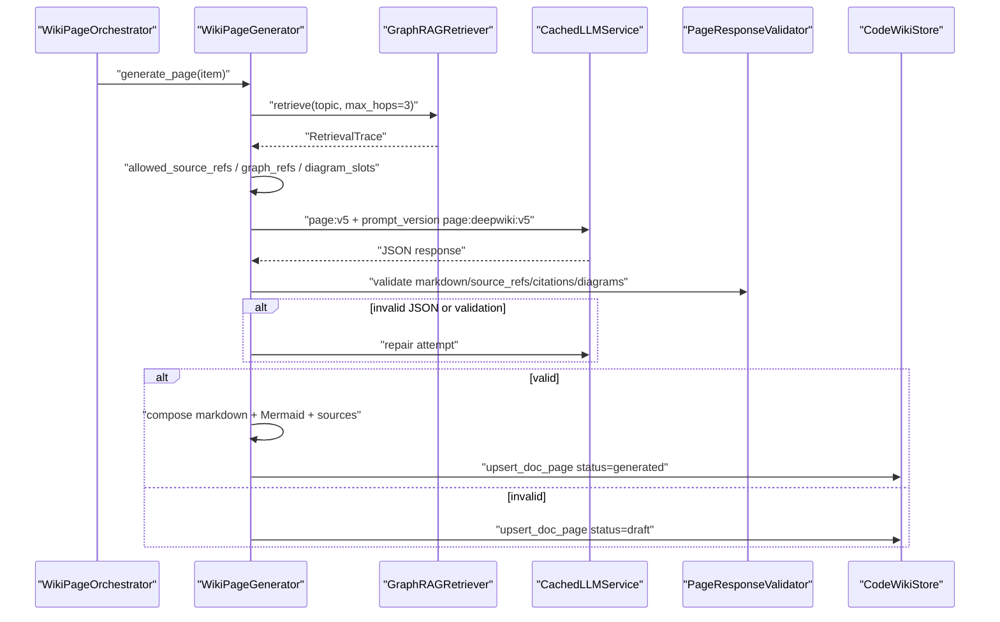

### 15.1 PageResponseValidator 的核心约束

`PageResponseValidator.validate()` 会做几类检查：

- 移除 LLM 自己写的 Mermaid block，因为 Mermaid 由服务端生成。
- 规范 citation marker。
- 校验 LLM 请求的 `source_refs` 是否在 allowed refs / trace chunks 里。
- 把 Markdown 里出现的合法 citation refs 合并进 source_refs。
- 过滤未使用的 refs。
- 要求至少一个合法 source_ref。
- 合并 readfile evidence refs。
- 校验页面 Markdown 结构。
- 校验 citation markers。
- 校验 diagram placeholders。

所以 source refs 不是“模型想引用什么就引用什么”。模型只能从检索 trace 和服务端读文件证据提供的范围里选择。

### 15.2 Mermaid 图由服务端生成

页面 payload 会给 LLM diagram slots，但实际 Mermaid 图由 `_mermaid_diagrams_from_trace()` 基于图事实生成。LLM 只在正文里放 placeholder。这样做的好处是：

- 图来自 Code Graph，不是模型凭空画。
- 图可以在服务端统一校验。
- 无效图可以被过滤或移除，不影响正文生成。

### 15.3 Parent page 依赖 child page

`WikiPageOrchestrator` 先生成 leaf pages。第一个 leaf 串行 warm-up，后续 leaf 并发，默认并发 3。然后对有 children 的父页面按深度从底到顶生成，并把 child page records 传给父页面。

这意味着父页面可以总结子页面，而不是和子页面完全独立生成，Wiki 结构更像真实文档站点。

## 16. Wiki 翻译：翻译正文，但保留代码、slug、引用和结构

CodeWiki 支持多语言 Wiki，但实现方式不是直接重新生成目标语言页面。

`WikiTranslationOrchestrator` 以 base language 为基准，默认 `en`。如果请求目标语言不是 base language，会先确保 base catalog/pages 存在，再翻译。

`WikiTranslator` 的规则很清楚：

- Catalog 翻译只翻译 human-facing title。
- 不翻译 slug、path、topic、source_hints、code identifiers。
- Page 翻译只翻译 prose 和 headings。
- 保留 code blocks、inline code、文件路径、URL、anchors、identifiers。
- 保留 source citations 和 source sections。
- 页面过长时按 Markdown block 切成最大约 8000 字符的 chunks。
- 翻译失败会保存 draft，draft 中保留源内容和错误信息。

翻译并发默认是 3，也有 JSON repair 机制，prompt version 是 `translation:wiki:v3`。

这套设计的重点是：翻译不改变证据链。source_refs 和 graph_refs 从源页面复制到目标语言页面，slug 也保持一致。

## 17. Agent Wiki Workflow：给 Agent 取证、写页、保存、校验

`WikiAgentWorkflow` 是 CodeWiki 里容易被误解的一块。它不是让模型自己循环调用工具自动写完整 Wiki，而是给外部 Agent 提供一个可控工作流：

- `plan()`：如果没有 catalog，就从图里生成一个 deterministic directory-based catalog，然后返回页面队列。
- `evidence(slug)`：对某页做 GraphRAG，返回 allowed_source_refs、retrieval_trace、catalog context 和写作 instructions。
- `save_page(slug, markdown)`：保存 agent 写好的 Markdown，并校验 citation 是否来自 allowed refs。
- `validate_page(slug)`：检查 H1、长度、source refs、citation markers 等。

这对 MCP 很重要。Agent 不需要一次把全仓库塞进上下文，而是可以：

```text
codewiki_wiki_plan
-> codewiki_wiki_evidence(slug)
-> Agent 写 Markdown，使用 [[S1]] 等引用
-> codewiki_wiki_page_save
-> codewiki_wiki_page_validate
```

这是一种“外部 Agent 受约束写文档”的设计。

## 18. API、CLI 和 MCP：同一套能力的三种调用方式

HTTP API 里几个关键路由如下：

```text
POST /api/repos
POST /api/repos/{repo_id}/analyze
POST /api/repos/{repo_id}/update
GET  /api/repos/{repo_id}/graph
GET  /api/repos/{repo_id}/graph/search
GET  /api/repos/{repo_id}/graph/callers
GET  /api/repos/{repo_id}/graph/callees
GET  /api/repos/{repo_id}/graph/impact
POST /api/repos/{repo_id}/graphrag/build
POST /api/repos/{repo_id}/graphrag/retrieve
POST /api/repos/{repo_id}/ask
POST /api/repos/{repo_id}/wiki/catalog
POST /api/repos/{repo_id}/wiki/pages/generate
POST /api/repos/{repo_id}/wiki/pages/update
POST /api/repos/{repo_id}/wiki/translate
```

涉及写入仓库状态的 API 会用 `repo_write_lock(repo_id)`，避免同一仓库并发分析、更新、生成 Wiki 时把图和页面写乱。

CLI 覆盖同样能力。例如：

```text
codewiki analyze
codewiki update
codewiki graphrag build
codewiki ask
codewiki wiki generate-catalog
codewiki wiki generate-pages
codewiki wiki update
codewiki lite index
codewiki lite context
codewiki mcp --lite --path .
```

MCP 工具更偏 Agent 任务：

- `codewiki_context`：对任务构建相关源码上下文，是 agent 架构问题的首选工具。
- `codewiki_trace`：在两个 symbol 之间找静态调用/引用路径。
- `codewiki_node`：读取一个 symbol 及 callers/callees/source。
- `codewiki_graph_affected`：根据变更文件找受影响文件、测试、Wiki 页面。

MCP 的 `graph_context`、`graph_trace`、`graph_node_context` 还会调用 `_with_pending_sync()`。如果 Lite index 检测到文件有未同步变化，会在返回 text 前加 warning，提示运行 `codewiki_update` 或 `codewiki lite sync`。这是给 Agent 的一个关键安全提示：别在过期索引上做判断。

## 19. Lite Mode：无 LLM 的本地 Agent 上下文层

Lite Mode 是 CodeWiki 很实用的工程化切面。

它在项目根目录创建：

```text
.codewiki/
  codewiki-lite.sqlite3
```

`codewiki lite index .` 会调用 `AnalysisService.analyze_with_community_summaries(name_communities=False)`，所以它不依赖 LLM。它只建立静态图谱、社区和索引。

Lite Mode 的命令包括：

- `init` / `uninit`
- `index`
- `sync`
- `watch`
- `status`
- `query`
- `callers` / `callees`
- `impact`
- `context`
- `trace`
- `node`
- `files`
- `affected`

它还支持 `agents install`，把 MCP server 配到 agent 客户端里。对 Codex CLI，`CodexLiteTarget` 会写全局 `~/.codex/config.toml` 的 MCP entry，并在 `~/.codex/AGENTS.md` 写入 marked instructions。因为 Codex CLI 没有项目本地 config，所以 local location 会提示使用 global。

这意味着 CodeWiki 不只是给 Web UI 人类使用，也能作为 coding agent 的项目级索引缓存。

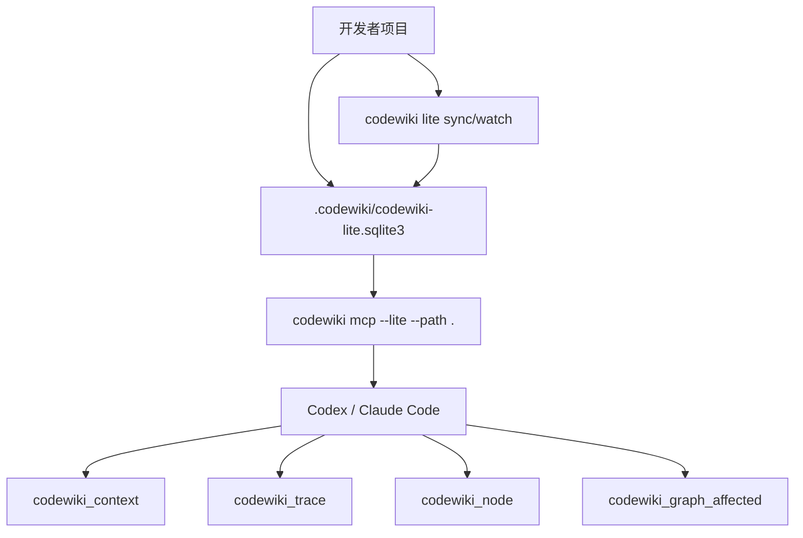

## 20. 前端工作台：Graph 是主画布，Wiki 和 Ask 是侧向工作流

前端使用 React 19 + TypeScript + Vite，主入口是 `frontend/src/App.tsx`。

页面结构不是传统 landing page，而是一个 local workbench：

- Repos：注册、选择仓库，打开 Graph/Wiki/Ask。
- Graph：图谱主视图。
- Wiki：生成、查看、导出 Wiki。
- Ask：GraphRAG 问答。
- Settings：查看和测试 LLM 配置。

Graph 前端有几层 builder：

- overview graph
- focus graph
- file detail graph
- container drilldown graph
- file detail symbols

这说明图谱展示不是把全部节点一次性丢给画布，而是按用户视角构建不同层次的可视图。

Wiki 前端也不是简单 Markdown 渲染。它有：

- `WikiCatalog`
- `WikiArticle`
- MermaidBlock
- Markdown normalize / sections / components
- source navigation
- related pages
- markdown / zip export

Ask 前端则围绕 `useAsk` 和 `AskResult` 展示 answer、sources、related graph。

整体产品设计和后端一致：用户先看图谱定位结构，再看 Wiki 建立全局理解，最后用 Ask 问局部问题。

## 21. 测试覆盖：核心链路都有针对性测试

从 `tests/backend` 可以看到覆盖重点：

- `test_repo_scanner.py`：仓库扫描。
- `test_ast_parser.py`：AST 解析。
- `test_analysis_service.py`：分析服务。
- `test_incremental_updater.py`：增量更新。
- `test_graph_query.py`：图查询。
- `test_graph_rag.py`：GraphRAG。
- `test_wiki_generator.py`：Wiki 生成。
- `test_llm_cache.py`：LLM cache。
- `test_model_router.py`：模型路由。
- `test_mcp_server.py`：MCP server。
- `test_postgres_store.py`：PostgreSQL store。
- `test_database_schema.py`：数据库 schema。
- `test_community_detector.py`、`test_community_edges.py`、`test_community_namer.py`：社区检测和命名。
- `test_question_answerer.py`：问答。
- `test_mermaid_validation.py`：Mermaid 校验。

这套测试文件分布说明项目的风险点被识别得比较清楚：AST、增量、GraphRAG、Wiki 校验、LLM 缓存、MCP 和多数据库后端都属于高风险模块。

## 22. 工程取舍：CodeWiki 为什么这样设计

### 22.1 先图谱，后 RAG

普通 RAG 直接从文本切片开始。CodeWiki 先做 AST 和图谱，这会增加复杂度，但换来的是：

- 符号级入口。
- 调用链和依赖扩展。
- 模块社区。
- 受影响分析。
- Wiki graph_refs。
- 前端可视图。

如果只做 chunk，后面这些能力都会很薄。

### 22.2 不追求编译器级精确，追求可解释置信度

CodeWiki 没有语言服务器那样的完整类型系统。跨文件 call/reference resolution 是启发式的。但它把 `confidence`、`is_inferred`、`reason` 写进边 metadata，让消费者知道哪些事实更确定，哪些是推断。

这是工程上很合理的取舍：比纯文本 RAG 结构强很多，又避免陷入完整静态分析的复杂泥潭。

### 22.3 Vector 是增强，不是硬依赖

GraphRAG 默认可以只靠 FTS 和图扩展运行。embedding 需要 LLM/embedding provider，成本更高，依赖更重，所以做成 `include_embeddings` 可选。

这让 Lite Mode 和本地初次体验更轻。

### 22.4 Wiki 生成不信任 LLM 输出

页面生成必须：

- JSON object。
- 引用 allowed source refs。
- 至少一个有效 source_ref。
- Markdown 结构合法。
- citation markers 合法。
- diagram placeholders 合法。
- Mermaid 服务端校验。

失败后保存 draft，而不是假装成功。这是文档生成工具最重要的质量边界。

### 22.5 用 LLM run 表同时做缓存和审计

`llm_run` 不是简单日志。它既是本地 cache，也是运行审计：

- task_type
- provider/model/model_alias
- prompt_version
- input_hash/cache_key
- tokens_in/tokens_out
- response_content/usage
- cached/status/error

这让大规模 Wiki 生成的成本、失败和缓存命中都可追踪。

### 22.6 local-first 优先于 SaaS 完整治理

默认 SQLite、WAL、FTS5、sqlite-vec、本地 storage、无多用户 auth。这些选择说明项目优先解决“个人或本地团队理解代码”的问题，而不是先做平台化权限系统。

如果要产品化成团队 SaaS，后续需要补：

- 多用户和权限。
- repo access control。
- 分布式任务队列。
- trace 持久化。
- 更完整的审计和隔离。
- 大仓库分片和异步索引调度。

## 23. 和普通代码 RAG 的横向对比

| 维度 | 普通代码 RAG | CodeWiki |
|---|---|---|
| 基础对象 | 文本 chunk | AST symbol + CodeGraph + chunk |
| 检索入口 | 向量相似度 | 符号搜索、FTS、可选 vector、图扩展 |
| 上下文结构 | 若干片段拼接 | source chunks + nodes + edges + communities |
| 调用关系 | 依赖模型推断 | 图边显式表达，带 confidence |
| 文档生成 | 直接让 LLM 写 | catalog 规划、page 校验、source_refs 约束 |
| 更新 | 常见是重建索引 | git diff/sha256 增量，stale wiki 标记 |
| Agent 接入 | 通常只有 search | MCP context/trace/node/wiki tools |
| 本地体验 | 依赖向量库/模型 | SQLite + FTS 可先跑，embedding 可选 |

面试里可以这样总结：

> 普通代码 RAG 是“先找相似文本，再让模型解释”。CodeWiki 是“先把仓库变成结构化图谱，再围绕图谱做检索、问答、文档和影响分析”。它把 LLM 从事实发现者降级成事实组织者，所以可靠性更高。

## 24. 面试追问视角：可以怎么回答

如果面试官问“CodeWiki 最核心解决什么问题”，可以答：

> 它解决的是大型代码仓库的可靠理解问题。直接让 LLM 读文件容易受上下文窗口和幻觉影响，所以 CodeWiki 先用 AST 和图谱建立确定性事实，再用 GraphRAG 选相关源码和依赖关系，最后用带 source_refs 校验的 LLM 生成 Wiki 或回答问题。

如果问“它和普通 RAG 最大区别是什么”，可以答：

> 普通 RAG 以 chunk 为中心，CodeWiki 以 graph 为中心。检索先找 symbol seed，再合并 FTS/vector chunk hit，然后沿 calls/imports/references/routes 等边扩展，最后把源码片段、节点、边、社区摘要一起打包给模型。

如果问“AST 图谱怎么建”，可以答：

> 扫描层先识别源码文件、语言、hash 和 Git 元数据；AST 层把多语言解析成统一 AstSymbol；GraphBuilder 再创建 repository、directory、file/config、symbol 节点，并建立 contains、defines、imports、exports、inherits、implements、routes_to、calls、references、uses_config 等边。推断边会标 confidence、is_inferred 和 reason。

如果问“Wiki 如何防止幻觉”，可以答：

> 页面生成不是让 LLM 随便写 Markdown。服务端先用 GraphRAG 得到 allowed source refs 和 graph refs，再给 LLM diagram slots 和 source constraints。LLM 必须返回 JSON，source_refs 必须来自允许范围，Markdown 里的 citation marker 必须匹配 source_refs，Mermaid 图由服务端根据图事实生成并校验。失败就保存 draft。

如果问“增量更新怎么做”，可以答：

> 它优先用 Git diff 找候选文件，再用 sha256 比较 changed/new/deleted/unchanged。只解析 changed/new 文件，对 unchanged 文件从旧图恢复 symbols，再重建图和社区。更新 chunks 后，会根据变更文件和受影响 graph refs 标记 Wiki 页面 stale。

如果问“为什么 vector 是可选的”，可以答：

> 因为 CodeWiki 的第一层召回不是向量，而是符号和 FTS。向量能增强语义搜索，但会引入 embedding 模型和向量索引依赖。把它做成可选，Lite Mode 和本地默认体验就能只依赖 SQLite/FTS 跑起来。

如果问“LLM 调用怎么治理”，可以答：

> 所有 LLM 任务都走 LiteLLM gateway 和 ModelRouter，按 catalog/page/translation/qa/embedding 等 task type 路由。`LLMOperation` 定义 cache namespace、input payload、prompt version，`llm_run` 表既做缓存又做审计，记录模型、token、usage、缓存命中、错误和 response content。

如果问“这个项目你会怎么继续优化”，可以答：

> 我会优先做三件事：第一，把 RetrievalTrace 持久化，方便复现问答和 Wiki 生成证据；第二，接入更精确的语言服务器或 tree-sitter query 增强跨文件解析，降低 inferred edge 的不确定性；第三，给大仓库做后台任务队列和索引分片，让 Web API 不直接承担长任务。

## 25. 总结：CodeWiki 的真正价值

CodeWiki 的价值不在于“给代码仓库加一个聊天框”，而在于它把代码理解拆成了几层可工程化的系统：

- 文件事实：扫描、语言、hash、Git 元数据。
- 结构事实：多语言 AST 到统一 `AstSymbol`。
- 关系事实：Code Graph 节点、边、置信度和 provenance。
- 模块事实：社区检测、父子社区、跨社区依赖。
- 检索事实：符号 seed、FTS、可选 vector、图扩展、source chunk budget。
- 文档事实：catalog、page、source_refs、graph_refs、Mermaid、translation。
- 运行事实：analysis_run、llm_run、cache、error、incremental stale marking。
- 使用入口：Web、CLI、MCP、Lite Mode。

最终它形成的是一个闭环：

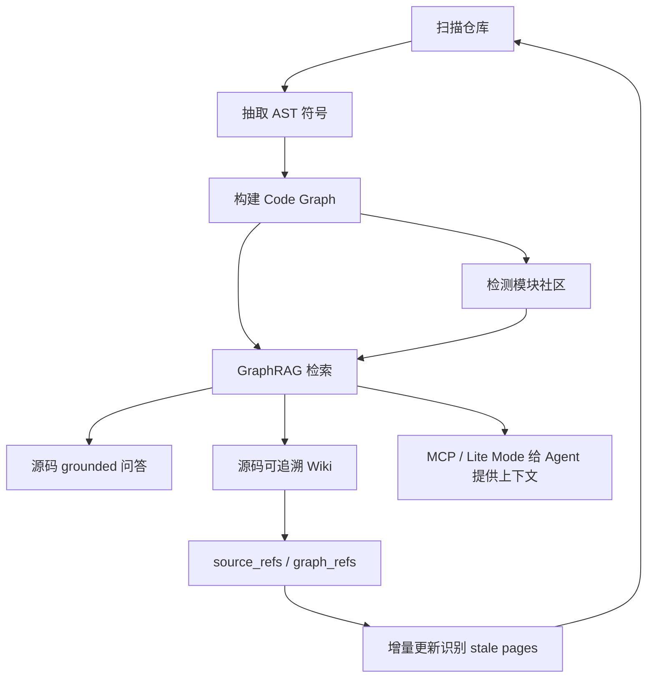

这套设计的核心思想可以总结成一句话：

> 让 LLM 站在 AST 图谱和源码证据之上工作，而不是让 LLM 凭记忆猜代码。

